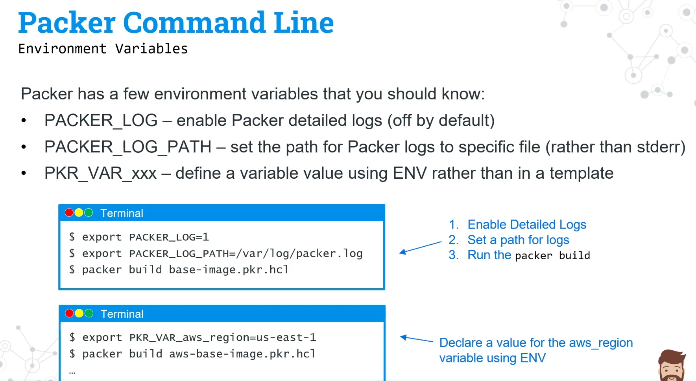

- [Lab 0: Install Packer](#lab-0-install-packer)
- [Lab 01 - Writing Packer Template](#lab-write-a-packer-template)
- [Lab 02 - Packer CLI](#lab-2-packer-cli)
- [Lab 03 - Building Images in Multiple Regions](#lab-building-images-in-multiple-regions)
- [Lab 04 - Provisioners](#lab-packer-provisioners)
- [Lab 05 - Post Processors](#lab-packer-post-processors)
- [Lab 06 - Packer Variables](#packer-variables)
- [Lab 07 - Building Multiple Image Types - Linux](#lab-building-images-for-different-operating-systems)
- [Lab 07 - Building Multiple Image Types - Windows](#lab-building-images-for-different-operating-systems-1)
- [Lab 08 - Validate Image with Terraform](#lab-validate-image-by-using-terraform)
- [Lab 09 - Building Images in Multiple Clouds](#lab-building-images-in-multiple-clouds)
- [Lab 10 - Code Organization](#lab-code-organization)
- [Lab 11 - Targeting Cloud Builds](#lab-target-clouds-and-build-types-using-packer)
- [Lab 12 - Packer Debug](#lab-debugging-packer)
- [Lab 13 - Packer Breakpoints](#lab-packer-breakpoints)
- [Lab 14 - Packer and Ansible](#lab-integrating-packer-with-ansible)
- [Lab 15 - Packer and Terraform](#lab-integrating-packer-with-terraform)
- [Lab Optional - Converting Packer JSON Templates to HCL](#lab-migrating-json-to-hcl2)



# Lab 0: Install Packer
Packer Packer may be installed in the following ways:

- Using a precompiled binary.
- Installing from source. (Recommended for advanced users)
- Using your system's package manager.

This lab will walk you through installing packer on an Ubuntu workstation using the `apt` package manager

Duration: 10 minutes

- Task 1: Install Packer on Ubuntu Workstation
- Task 2: Validate the Packer Install
- Task 3: Enable autocompletion for Packer CLI

### Task 1: Install Packer on Ubuntu Workstation
```bash
curl -fsSL https://apt.releases.hashicorp.com/gpg | sudo apt-key add -
sudo apt-add-repository "deb [arch=amd64] https://apt.releases.hashicorp.com $(lsb_release -cs) main"
sudo apt-get update && sudo apt-get install packer
sudo cp /usr/bin/packer /usr/local/bin/packer
```

### Task 2: Validate the Packer Install
```bash
which packer
/usr/local/bin/packer
```

```bash
packer version
Packer v1.7.2
```

### Task 3: Enable autocompletion for Packer CLI
```bash
packer -autocomplete-install
```

-----

# Lab: Write a Packer Template
This lab will walk you through updating a Packer HCL Template. It uses the amazon-ebs source to create a custom image in the us-west-2 region of AWS.

Duration: 30 minutes

- Task 1: Create a Source Block
- Task 2: Validate the Packer Template
- Task 3: Create a Builder Block
- Task 4: Build a new Image using Packer

## Creating a Packer Template

```bash
mkdir packer_templates
cd packer_templates
```

### Task 1: Create a Source Block
Source blocks define what kind of virtualization to use for the image, how to launch the image and how to connect to the image.  Sources can be used across multiple builds.  We will use the `amazon-ebs` source configuration to launch a `t2.micro` AMI in the `us-west-2` region.

### Step 1.1.1

Create a `aws-ubuntu.pkr.hcl` file with the following Packer `source` block.

```hcl
source "amazon-ebs" "ubuntu" {
  ami_name      = "packer-ubuntu-aws-{{timestamp}}"
  instance_type = "t2.micro"
  region        = "us-west-2"
  source_ami_filter {
    filters = {
      name                = "ubuntu/images/*ubuntu-xenial-16.04-amd64-server-*"
      root-device-type    = "ebs"
      virtualization-type = "hvm"
    }
    most_recent = true
    owners      = ["099720109477"]
  }
  ssh_username = "ubuntu"
}
```

### Task 2: Validate the Packer Template
Packer templates can be auto formatted and validated via the Packer command line.

### Step 2.1.1

Format and validate your configuration using the `packer fmt` and `packer validate` commands.

```shell
packer fmt aws-ubuntu.pkr.hcl 
packer validate aws-ubuntu.pkr.hcl
```

### Task 3: Create a Builder Block
Builders are responsible for creating machines and generating images from them for various platforms.  They are use in tandem with the source block within a template.

### Step 3.1.1
Add a builder block to `aws-ubuntu.pkr.hcl` referencing the source specified above.  The source can be referenced usin the HCL interpolation syntax.

```hcl
build {
  sources = [
    "source.amazon-ebs.ubuntu"
  ]
}
```

### Task 4: Build a new Image using Packer
The `packer build` command is used to initiate the image build process for a given Packer template. For this lab, please note that you will need credentials for your AWS account in order to properly execute a `packer build`. You can set your credentials using [environment variables](https://docs.aws.amazon.com/cli/latest/userguide/cli-configure-envvars.html#linux), using [aws configure](https://docs.aws.amazon.com/cli/latest/reference/configure/) if you have the AWSCLI installed, or [embed the credentials](https://www.packer.io/docs/builders/amazon/ebsvolume#access-configuration) in the template.

### Step 4.1.1
Run a `packer build` for the `aws-ubuntu.pkr.hcl` template.

```shell
packer build aws-ubuntu.pkr.hcl
```

Packer will print output similar to what is shown below.

```bash
amazon-ebs.ubuntu: output will be in this color.

==> amazon-ebs.ubuntu: Prevalidating any provided VPC information
==> amazon-ebs.ubuntu: Prevalidating AMI Name: packer-ubuntu-aws-1620827902
    amazon-ebs.ubuntu: Found Image ID: ami-0dd273d94ed0540c0
==> amazon-ebs.ubuntu: Creating temporary keypair: packer_609bdefe-f179-a11c-3bfd-6f4deda66c99
==> amazon-ebs.ubuntu: Creating temporary security group for this instance: packer_609bdf00-c182-00a1-e516-32aea832ff9e
==> amazon-ebs.ubuntu: Authorizing access to port 22 from [0.0.0.0/0] in the temporary security groups...
==> amazon-ebs.ubuntu: Launching a source AWS instance...
==> amazon-ebs.ubuntu: Adding tags to source instance
    amazon-ebs.ubuntu: Adding tag: "Name": "Packer Builder"
    amazon-ebs.ubuntu: Instance ID: i-0c9a0b1b896b8c95a
==> amazon-ebs.ubuntu: Waiting for instance (i-0c9a0b1b896b8c95a) to become ready...
==> amazon-ebs.ubuntu: Using ssh communicator to connect: 34.219.135.12
==> amazon-ebs.ubuntu: Waiting for SSH to become available...
==> amazon-ebs.ubuntu: Connected to SSH!
==> amazon-ebs.ubuntu: Stopping the source instance...
    amazon-ebs.ubuntu: Stopping instance
==> amazon-ebs.ubuntu: Waiting for the instance to stop...
==> amazon-ebs.ubuntu: Creating AMI packer-ubuntu-aws-1620827902 from instance i-0c9a0b1b896b8c95a
    amazon-ebs.ubuntu: AMI: ami-0561bdc79bbb8f5a0
==> amazon-ebs.ubuntu: Waiting for AMI to become ready...
==> amazon-ebs.ubuntu: Terminating the source AWS instance...
==> amazon-ebs.ubuntu: Cleaning up any extra volumes...
==> amazon-ebs.ubuntu: No volumes to clean up, skipping
==> amazon-ebs.ubuntu: Deleting temporary security group...
==> amazon-ebs.ubuntu: Deleting temporary keypair...
Build 'amazon-ebs.ubuntu' finished after 3 minutes 16 seconds.

==> Wait completed after 3 minutes 16 seconds

==> Builds finished. The artifacts of successful builds are:
--> amazon-ebs.ubuntu: AMIs were created:
us-west-2: ami-0561bdc79bbb8f5a0
```

**Note:** This lab assumes you have the default VPC available in your account. If you do not, you will need to add the [`vpc_id`](https://www.packer.io/docs/builders/amazon/ebs#vpc_id) and [`subnet_id`](https://www.packer.io/docs/builders/amazon/ebs#subnet_id). The subnet will need to have public access and a valid route to an Internet Gateway.

##### Resources
* Packer [Docs](https://www.packer.io/docs/index.html)
* Packer [CLI](https://www.packer.io/docs/commands/index.html)
---

# Lab 2: Packer CLI
The Packer command line interface (CLI) is how users/applications interact with Packer.  There is no UI or API for Packer.

Duration: 15 minutes

- Task 1: Explore the Packer CLI
- Task 2: Packer Version
- Task 3: Enable autocompletion for Packer CLI
- Task 4: Explore Subcommands and Flags
- Task 5: Packer fmt

### Task 1: Use the Terraform CLI to Get Help

Execute the following command to display available commands:

```bash
packer -help
```

```bash
Usage: packer [--version] [--help] <command> [<args>]

Available commands are:
    build           build image(s) from template
    console         creates a console for testing variable interpolation
    fix             fixes templates from old versions of packer
    fmt             Rewrites HCL2 config files to canonical format
    hcl2_upgrade    transform a JSON template into an HCL2 configuration
    init            Install missing plugins or upgrade plugins
    inspect         see components of a template
    validate        check that a template is valid
    version         Prints the Packer version
```

Or, you can use short-hand:

```shell
packer -h
```

### Task 2: Packer Version
Run the following command to check the Packer version:

```shell
packer -version
```

You should see:

```bash
packer -version
1.7.2
```

These labs will be building Packer configuration using HCL.  Your Packer version must be newer then 1.7.0 to utilize the HCL configuration.  If your version is older than 1.7.0, please reinstall Packer with a newer version.

### Task 3: Enable autocompletion for Packer CLI
The packer command features opt-in subcommand autocompletion that you can enable for your shell with `packer -autocomplete-install`. After doing so, you can invoke a new shell and use the feature.

```bash
packer -autocomplete-install
```

If autocompletion was already turned on, this command will indicate that it is already installed.

### Task 4: Explore Subcommands and Flags
Like many other command-line tools, the packer tool takes a subcommand to execute, and that subcommand may have additional options as well. Subcommands are executed with packer SUBCOMMAND, where "SUBCOMMAND" is the actual command you wish to execute.

You can run any packer command with the -h flag to output more detailed help for a specific subcommand.

```bash
packer validate -h
```

```bash
Usage: packer validate [options] TEMPLATE

  Checks the template is valid by parsing the template and also
  checking the configuration with the various builders, provisioners, etc.

  If it is not valid, the errors will be shown and the command will exit
  with a non-zero exit status. If it is valid, it will exit with a zero
  exit status.

Options:

  -syntax-only           Only check syntax. Do not verify config of the template.
  -except=foo,bar,baz    Validate all builds other than these.
  -machine-readable      Produce machine-readable output.
  -only=foo,bar,baz      Validate only these builds.
  -var 'key=value'       Variable for templates, can be used multiple times.
  -var-file=path         JSON or HCL2 file containing user variables.
```

```bash
packer validate aws-ubuntu.pkr.hcl
```

### Task 5: Packer fmt
The `packer fmt` Packer command is used to format HCL2 configuration files to a canonical format and style. JSON files (.json) are not modified.  `packer fmt` will display the name of the configuration file(s) that need formatting, and write any formatted changes back to the original configuration file(s).

```bash
packer fmt -diff aws-ubuntu.pkr.hcl
```

If there were formatted changes as a result of running the `packer fmt` command, those changes will be highlighted when specifiying the `-diff` flag.

```
aws-ubuntu.pkr.hcl
--- old/aws-ubuntu.pkr.hcl
+++ new/aws-ubuntu.pkr.hcl
@@ -6,9 +6,9 @@
     filters = {
       name                = "ubuntu/images/*ubuntu-xenial-16.04-amd64-server-*"
       root-device-type    = "ebs"
-    virtualization-type = "hvm"
+      virtualization-type = "hvm"
     }
-        most_recent = true
+    most_recent = true
     owners      = ["099720109477"]
   }
   ssh_username = "ubuntu"
```

### Task 5: Packer Inspect
The `packer inspect` command shows all components of a Packer template including variables, builds, sources, provisioners and post-processsors.

```bash
packer inspect aws-ubuntu.pkr.hcl
```

```bash
Packer Inspect: HCL2 mode

> input-variables:


> local-variables:


> builds:

  > <unnamed build 0>:

    sources:

      amazon-ebs.ubuntu

    provisioners:

      <no provisioner>

    post-processors:

      <no post-processor>
```

Notice that there are not any variables, provisioners or post-processors in our configuration at this time.  We will be adding those items in future labs.

---

# Lab: Building Images in Multiple Regions
This lab will walk you through updating your Packer Template to build images across multiple regions within AWS.

Duration: 30 minutes

- Task 1: Update Packer Template to support Multiple Regions
- Task 2: Validate the Packer Template
- Task 3: Build Image across Multiple AWS Regions

### Task 1: Update Packer Template to support Multiple Regions
The Packer AWS builder supports the ability to create an AMI in multiple AWS regions.  AMIs are specific to regions so this will ensure that the same image is available in all regions within a single cloud.  We will also leverage Tags to indentify our image.

### Step 1.1.1

Update your `aws-ubuntu.pkr.hcl` file with the following Packer `source` block.

```hcl
source "amazon-ebs" "ubuntu" {
  ami_name      = "packer-ubuntu-aws-{{timestamp}}"
  instance_type = "t2.micro"
  region        = "us-west-2"
  ami_regions   = ["us-west-2", "us-east-1", "eu-central-1"]
  source_ami_filter {
    filters = {
      name                = "ubuntu/images/*ubuntu-xenial-16.04-amd64-server-*"
      root-device-type    = "ebs"
      virtualization-type = "hvm"
    }
    most_recent = true
    owners      = ["099720109477"]
  }
  ssh_username = "ubuntu"
  tags = {
    "Name"        = "MyUbuntuImage"
    "Environment" = "Production"
    "OS_Version"  = "Ubuntu 16.04"
    "Release"     = "Latest"
    "Created-by"  = "Packer"
  }
}
```

### Task 2: Validate the Packer Template
Packer templates can be auto formatted and validated via the Packer command line.

### Step 2.1.1

Format and validate your configuration using the `packer fmt` and `packer validate` commands.

```shell
packer fmt aws-ubuntu.pkr.hcl 
packer validate aws-ubuntu.pkr.hcl
```

### Task 3: Build Image across Multiple AWS Regions
The `packer build` command is used to initiate the image build process for a given Packer template.

### Step 3.1.1
Run a `packer build` for the `aws-ubuntu.pkr.hcl` template.

```shell
packer build aws-ubuntu.pkr.hcl
```

Packer will print output similar to what is shown below.

```bash
➜  packer build aws-ubuntu.pkr.hcl
amazon-ebs.ubuntu: output will be in this color.

==> amazon-ebs.ubuntu: Prevalidating any provided VPC information
==> amazon-ebs.ubuntu: Prevalidating AMI Name: packer-ubuntu-aws
    amazon-ebs.ubuntu: Found Image ID: ami-0dd273d94ed0540c0
==> amazon-ebs.ubuntu: Creating temporary keypair: packer_609212c5-c68b-dc41-0eb9-7cb972a8b9eb
==> amazon-ebs.ubuntu: Creating temporary security group for this instance: packer_609212c8-d327-58c7-186c-13f94c74d862
==> amazon-ebs.ubuntu: Authorizing access to port 22 from [0.0.0.0/0] in the temporary security groups...
==> amazon-ebs.ubuntu: Launching a source AWS instance...
==> amazon-ebs.ubuntu: Adding tags to source instance
    amazon-ebs.ubuntu: Adding tag: "Name": "Packer Builder"
    amazon-ebs.ubuntu: Instance ID: i-0f44e7c3f7c7210fe
==> amazon-ebs.ubuntu: Waiting for instance (i-0f44e7c3f7c7210fe) to become ready...
==> amazon-ebs.ubuntu: Using ssh communicator to connect: 34.212.137.135
==> amazon-ebs.ubuntu: Waiting for SSH to become available...
==> amazon-ebs.ubuntu: Connected to SSH!
==> amazon-ebs.ubuntu: Stopping the source instance...
    amazon-ebs.ubuntu: Stopping instance
==> amazon-ebs.ubuntu: Waiting for the instance to stop...
==> amazon-ebs.ubuntu: Creating AMI packer-ubuntu-aws from instance i-0f44e7c3f7c7210fe
    amazon-ebs.ubuntu: AMI: ami-00888c7a855bd746e
==> amazon-ebs.ubuntu: Waiting for AMI to become ready...
==> amazon-ebs.ubuntu: Copying/Encrypting AMI (ami-00888c7a855bd746e) to other regions...
    amazon-ebs.ubuntu: Copying to: us-east-1
    amazon-ebs.ubuntu: Copying to: eu-central-1
    amazon-ebs.ubuntu: Waiting for all copies to complete...
==> amazon-ebs.ubuntu: Adding tags to AMI (ami-00888c7a855bd746e)...
==> amazon-ebs.ubuntu: Tagging snapshot: snap-0f96df693fc7e347e
==> amazon-ebs.ubuntu: Creating AMI tags
    amazon-ebs.ubuntu: Adding tag: "Name": "MyUbuntuImage"
    amazon-ebs.ubuntu: Adding tag: "Version": "Latest"
    amazon-ebs.ubuntu: Adding tag: "Environment": "Production"
==> amazon-ebs.ubuntu: Creating snapshot tags
==> amazon-ebs.ubuntu: Adding tags to AMI (ami-0c8839484fe21cabd)...
==> amazon-ebs.ubuntu: Tagging snapshot: snap-00b593cda536fd3d1
==> amazon-ebs.ubuntu: Creating AMI tags
    amazon-ebs.ubuntu: Adding tag: "Environment": "Production"
    amazon-ebs.ubuntu: Adding tag: "Name": "MyUbuntuImage"
    amazon-ebs.ubuntu: Adding tag: "Version": "Latest"
==> amazon-ebs.ubuntu: Creating snapshot tags
==> amazon-ebs.ubuntu: Adding tags to AMI (ami-0050f6e5610e47950)...
==> amazon-ebs.ubuntu: Tagging snapshot: snap-0d1ab9c893da1f615
==> amazon-ebs.ubuntu: Creating AMI tags
    amazon-ebs.ubuntu: Adding tag: "Environment": "Production"
    amazon-ebs.ubuntu: Adding tag: "Name": "MyUbuntuImage"
    amazon-ebs.ubuntu: Adding tag: "Version": "Latest"
==> amazon-ebs.ubuntu: Creating snapshot tags
==> amazon-ebs.ubuntu: Terminating the source AWS instance...
==> amazon-ebs.ubuntu: Cleaning up any extra volumes...
==> amazon-ebs.ubuntu: No volumes to clean up, skipping
==> amazon-ebs.ubuntu: Deleting temporary security group...
==> amazon-ebs.ubuntu: Deleting temporary keypair...
Build 'amazon-ebs.ubuntu' finished after 8 minutes 39 seconds.

==> Wait completed after 8 minutes 39 seconds

==> Builds finished. The artifacts of successful builds are:
--> amazon-ebs.ubuntu: AMIs were created:
eu-central-1: ami-0050f6e5610e47950
us-east-1: ami-0c8839484fe21cabd
us-west-2: ami-00888c7a855bd746e
```

Note that we now have created the same image in the `eu-central-1`, `us-east-1` and `us-west-2` regions.

##### Resources
* Packer [Docs](https://www.packer.io/docs/index.html)
* Packer [CLI](https://www.packer.io/docs/commands/index.html)

---

# Lab: Packer Provisioners
This lab will walk you through adding a provisioner to your Packer HCL Template. Provisioners use built-in and third-party software to install and configure the machine image after booting.

Duration: 30 minutes

- Task 1: Add a Packer provisioner to install all updates and the nginx service
- Task 2: Validate the Packer Template
- Task 3: Build a new Image using Packer
- Task 4: Install Web App

### Task 1: Update Packer Template to support Multiple Regions
The Packer AWS builder supports the ability to create an AMI in multiple AWS regions.  AMIs are specific to regions so this will ensure that the same image is available in all regions within a single cloud.  We will also leverage Tags to indentify our image.

### Step 1.1.1

Validate that your `aws-ubuntu.pkr.hcl` file has the following Packer `source` block.

```hcl
source "amazon-ebs" "ubuntu" {
  ami_name      = "packer-ubuntu-aws-{{timestamp}}"
  instance_type = "t2.micro"
  region        = "us-west-2"
  ami_regions   = ["us-west-2", "us-east-1", "eu-central-1"]
  source_ami_filter {
    filters = {
      name                = "ubuntu/images/*ubuntu-xenial-16.04-amd64-server-*"
      root-device-type    = "ebs"
      virtualization-type = "hvm"
    }
    most_recent = true
    owners      = ["099720109477"]
  }
  ssh_username = "ubuntu"
  tags = {
    "Name"        = "MyUbuntuImage"
    "Environment" = "Production"
    "OS_Version"  = "Ubuntu 16.04"
    "Release"     = "Latest"
    "Created-by"  = "Packer"
  }
}
```

Add a provisioner to the `builder` block of your `aws-ubuntu.pkr.hcl`

```hcl
build {
  sources = [
    "source.amazon-ebs.ubuntu"
  ]

  provisioner "shell" {
    inline = [
      "echo Installing Updates",
      "sudo apt-get update",
      "sudo apt-get upgrade -y",
      "sudo apt-get install -y nginx"
    ]
  }
}
```

### Task 2: Validate the Packer Template
Packer templates can be auto formatted and validated via the Packer command line.

### Step 2.1.1

Format and validate your configuration using the `packer fmt` and `packer validate` commands.

```shell
packer fmt aws-ubuntu.pkr.hcl 
packer validate aws-ubuntu.pkr.hcl
```

### Task 3: Build a new Image using Packer
The `packer build` command is used to initiate the image build process for a given Packer template.

### Step 3.1.1
Run a `packer build` for the `aws-ubuntu.pkr.hcl` template.

```shell
packer build aws-ubuntu.pkr.hcl
```

Packer will print output similar to what is shown below.  Note the connection to SSH and the provisioning of the updtes and services before the image is finalized.

```bash
amazon-ebs.ubuntu: output will be in this color.

==> amazon-ebs.ubuntu: Prevalidating any provided VPC information
==> amazon-ebs.ubuntu: Prevalidating AMI Name: packer-ubuntu-aws-1620834314
    amazon-ebs.ubuntu: Found Image ID: ami-0dd273d94ed0540c0
==> amazon-ebs.ubuntu: Creating temporary keypair: packer_609bf80a-7759-bf2c-8ba3-91132538f80f
==> amazon-ebs.ubuntu: Creating temporary security group for this instance: packer_609bf80d-42af-bc1e-0e1f-e914806fb809
==> amazon-ebs.ubuntu: Authorizing access to port 22 from [0.0.0.0/0] in the temporary security groups...
==> amazon-ebs.ubuntu: Launching a source AWS instance...
==> amazon-ebs.ubuntu: Adding tags to source instance
    amazon-ebs.ubuntu: Adding tag: "Name": "Packer Builder"
    amazon-ebs.ubuntu: Instance ID: i-0348c8cc4584f902a
==> amazon-ebs.ubuntu: Waiting for instance (i-0348c8cc4584f902a) to become ready...
==> amazon-ebs.ubuntu: Using ssh communicator to connect: 52.33.179.108
==> amazon-ebs.ubuntu: Waiting for SSH to become available...
==> amazon-ebs.ubuntu: Connected to SSH!
==> amazon-ebs.ubuntu: Provisioning with shell script: /tmp/packer-shell794569831
    amazon-ebs.ubuntu: Installing Updates
    amazon-ebs.ubuntu: Get:1 http://security.ubuntu.com/ubuntu xenial-security InRelease [109 kB]
    amazon-ebs.ubuntu: Get:2 https://esm.ubuntu.com/infra/ubuntu xenial-infra-security InRelease [7515 B]
    amazon-ebs.ubuntu: Get:3 http://security.ubuntu.com/ubuntu xenial-security/universe amd64 Packages [785 kB]
    amazon-ebs.ubuntu: Get:4 https://esm.ubuntu.com/infra/ubuntu xenial-infra-updates InRelease [7475 B]
    amazon-ebs.ubuntu: Hit:5 http://archive.ubuntu.com/ubuntu xenial InRelease
    amazon-ebs.ubuntu: Get:6 http://security.ubuntu.com/ubuntu xenial-security/universe Translation-en [225 kB]
    amazon-ebs.ubuntu: Get:7 http://security.ubuntu.com/ubuntu xenial-security/multiverse amd64 Packages [7864 B]
    amazon-ebs.ubuntu: Get:8 http://security.ubuntu.com/ubuntu xenial-security/multiverse Translation-en [2672 B]
    amazon-ebs.ubuntu: Get:9 http://archive.ubuntu.com/ubuntu xenial-updates InRelease [109 kB]
    amazon-ebs.ubuntu: Get:10 https://esm.ubuntu.com/infra/ubuntu xenial-infra-security/main amd64 Packages [250 kB]
    amazon-ebs.ubuntu: Get:11 http://archive.ubuntu.com/ubuntu xenial-backports InRelease [107 kB]
    amazon-ebs.ubuntu: Get:12 http://archive.ubuntu.com/ubuntu xenial/universe amd64 Packages [7532 kB]
    amazon-ebs.ubuntu: Get:13 http://archive.ubuntu.com/ubuntu xenial/universe Translation-en [4354 kB]
    amazon-ebs.ubuntu: Get:14 http://archive.ubuntu.com/ubuntu xenial/multiverse amd64 Packages [144 kB]
    amazon-ebs.ubuntu: Get:15 http://archive.ubuntu.com/ubuntu xenial/multiverse Translation-en [106 kB]
    amazon-ebs.ubuntu: Get:16 http://archive.ubuntu.com/ubuntu xenial-updates/main amd64 Packages [2049 kB]
    amazon-ebs.ubuntu: Get:17 http://archive.ubuntu.com/ubuntu xenial-updates/universe amd64 Packages [1219 kB]
    amazon-ebs.ubuntu: Get:18 http://archive.ubuntu.com/ubuntu xenial-updates/universe Translation-en [358 kB]
    amazon-ebs.ubuntu: Get:19 http://archive.ubuntu.com/ubuntu xenial-updates/multiverse amd64 Packages [22.6 kB]
    amazon-ebs.ubuntu: Get:20 http://archive.ubuntu.com/ubuntu xenial-updates/multiverse Translation-en [8476 B]
    amazon-ebs.ubuntu: Get:21 http://archive.ubuntu.com/ubuntu xenial-backports/main amd64 Packages [9812 B]
    amazon-ebs.ubuntu: Get:22 http://archive.ubuntu.com/ubuntu xenial-backports/main Translation-en [4456 B]
    amazon-ebs.ubuntu: Get:23 http://archive.ubuntu.com/ubuntu xenial-backports/universe amd64 Packages [11.3 kB]
    amazon-ebs.ubuntu: Get:24 http://archive.ubuntu.com/ubuntu xenial-backports/universe Translation-en [4476 B]
    amazon-ebs.ubuntu: Fetched 17.4 MB in 7s (2273 kB/s)
    amazon-ebs.ubuntu: Reading package lists...
    amazon-ebs.ubuntu: Reading package lists...
    amazon-ebs.ubuntu: Building dependency tree...
    amazon-ebs.ubuntu: Reading state information...
    amazon-ebs.ubuntu: Calculating upgrade...
    amazon-ebs.ubuntu: The following packages will be upgraded:
    amazon-ebs.ubuntu:   ubuntu-advantage-tools
    amazon-ebs.ubuntu: 1 upgraded, 0 newly installed, 0 to remove and 0 not upgraded.
    amazon-ebs.ubuntu: Need to get 703 kB of archives.
    amazon-ebs.ubuntu: After this operation, 60.4 kB of additional disk space will be used.
    amazon-ebs.ubuntu: Get:1 http://us-west-2.ec2.archive.ubuntu.com/ubuntu xenial-updates/main amd64 ubuntu-advantage-tools amd64 27.4.1~16.04.1 [703 kB]
==> amazon-ebs.ubuntu: debconf: unable to initialize frontend: Dialog
==> amazon-ebs.ubuntu: debconf: (Dialog frontend will not work on a dumb terminal, an emacs shell buffer, or without a controlling terminal.)
==> amazon-ebs.ubuntu: debconf: falling back to frontend: Readline
==> amazon-ebs.ubuntu: debconf: unable to initialize frontend: Readline
==> amazon-ebs.ubuntu: debconf: (This frontend requires a controlling tty.)
==> amazon-ebs.ubuntu: debconf: falling back to frontend: Teletype
==> amazon-ebs.ubuntu: dpkg-preconfigure: unable to re-open stdin:
    amazon-ebs.ubuntu: Fetched 703 kB in 0s (33.4 MB/s)
    amazon-ebs.ubuntu: (Reading database ... 51560 files and directories currently installed.)
    amazon-ebs.ubuntu: Preparing to unpack .../ubuntu-advantage-tools_27.4.1~16.04.1_amd64.deb ...
    amazon-ebs.ubuntu: Unpacking ubuntu-advantage-tools (27.4.1~16.04.1) over (27.2.2~16.04.1) ...
    amazon-ebs.ubuntu: Processing triggers for man-db (2.7.5-1) ...
    amazon-ebs.ubuntu: Setting up ubuntu-advantage-tools (27.4.1~16.04.1) ...
    amazon-ebs.ubuntu: Installing new version of config file /etc/logrotate.d/ubuntu-advantage-tools ...
    amazon-ebs.ubuntu: Installing new version of config file /etc/ubuntu-advantage/help_data.yaml ...
    amazon-ebs.ubuntu: Installing new version of config file /etc/ubuntu-advantage/uaclient.conf ...
    amazon-ebs.ubuntu: debconf: unable to initialize frontend: Dialog
    amazon-ebs.ubuntu: debconf: (Dialog frontend will not work on a dumb terminal, an emacs shell buffer, or without a controlling terminal.)
    amazon-ebs.ubuntu: debconf: falling back to frontend: Readline
    amazon-ebs.ubuntu: Reading package lists...
    amazon-ebs.ubuntu: Building dependency tree...
    amazon-ebs.ubuntu: Reading state information...
    amazon-ebs.ubuntu: The following additional packages will be installed:
    amazon-ebs.ubuntu:   fontconfig-config fonts-dejavu-core libfontconfig1 libgd3 libjbig0
    amazon-ebs.ubuntu:   libjpeg-turbo8 libjpeg8 libtiff5 libvpx3 libxpm4 nginx-common nginx-core
    amazon-ebs.ubuntu: Suggested packages:
    amazon-ebs.ubuntu:   libgd-tools fcgiwrap nginx-doc ssl-cert
    amazon-ebs.ubuntu: The following NEW packages will be installed:
    amazon-ebs.ubuntu:   fontconfig-config fonts-dejavu-core libfontconfig1 libgd3 libjbig0
    amazon-ebs.ubuntu:   libjpeg-turbo8 libjpeg8 libtiff5 libvpx3 libxpm4 nginx nginx-common
    amazon-ebs.ubuntu:   nginx-core
    amazon-ebs.ubuntu: 0 upgraded, 13 newly installed, 0 to remove and 0 not upgraded.
    amazon-ebs.ubuntu: Need to get 2,860 kB of archives.
    amazon-ebs.ubuntu: After this operation, 9,315 kB of additional disk space will be used.
    amazon-ebs.ubuntu: Get:1 http://us-west-2.ec2.archive.ubuntu.com/ubuntu xenial-updates/main amd64 libjpeg-turbo8 amd64 1.4.2-0ubuntu3.4 [111 kB]
    amazon-ebs.ubuntu: Get:2 http://us-west-2.ec2.archive.ubuntu.com/ubuntu xenial/main amd64 libjbig0 amd64 2.1-3.1 [26.6 kB]
    amazon-ebs.ubuntu: Get:3 http://us-west-2.ec2.archive.ubuntu.com/ubuntu xenial/main amd64 fonts-dejavu-core all 2.35-1 [1,039 kB]
    amazon-ebs.ubuntu: Get:4 http://us-west-2.ec2.archive.ubuntu.com/ubuntu xenial-updates/main amd64 fontconfig-config all 2.11.94-0ubuntu1.1 [49.9 kB]
    amazon-ebs.ubuntu: Get:5 http://us-west-2.ec2.archive.ubuntu.com/ubuntu xenial-updates/main amd64 libfontconfig1 amd64 2.11.94-0ubuntu1.1 [131 kB]
    amazon-ebs.ubuntu: Get:6 http://us-west-2.ec2.archive.ubuntu.com/ubuntu xenial/main amd64 libjpeg8 amd64 8c-2ubuntu8 [2,194 B]
    amazon-ebs.ubuntu: Get:7 http://us-west-2.ec2.archive.ubuntu.com/ubuntu xenial-updates/main amd64 libtiff5 amd64 4.0.6-1ubuntu0.8 [149 kB]
    amazon-ebs.ubuntu: Get:8 http://us-west-2.ec2.archive.ubuntu.com/ubuntu xenial-updates/main amd64 libvpx3 amd64 1.5.0-2ubuntu1.1 [732 kB]
    amazon-ebs.ubuntu: Get:9 http://us-west-2.ec2.archive.ubuntu.com/ubuntu xenial-updates/main amd64 libxpm4 amd64 1:3.5.11-1ubuntu0.16.04.1 [33.8 kB]
    amazon-ebs.ubuntu: Get:10 http://us-west-2.ec2.archive.ubuntu.com/ubuntu xenial-updates/main amd64 libgd3 amd64 2.1.1-4ubuntu0.16.04.12 [126 kB]
    amazon-ebs.ubuntu: Get:11 http://us-west-2.ec2.archive.ubuntu.com/ubuntu xenial-updates/main amd64 nginx-common all 1.10.3-0ubuntu0.16.04.5 [26.9 kB]
    amazon-ebs.ubuntu: Get:12 http://us-west-2.ec2.archive.ubuntu.com/ubuntu xenial-updates/main amd64 nginx-core amd64 1.10.3-0ubuntu0.16.04.5 [429 kB]
    amazon-ebs.ubuntu: Get:13 http://us-west-2.ec2.archive.ubuntu.com/ubuntu xenial-updates/main amd64 nginx all 1.10.3-0ubuntu0.16.04.5 [3,494 B]
==> amazon-ebs.ubuntu: debconf: unable to initialize frontend: Dialog
==> amazon-ebs.ubuntu: debconf: (Dialog frontend will not work on a dumb terminal, an emacs shell buffer, or without a controlling terminal.)
==> amazon-ebs.ubuntu: debconf: falling back to frontend: Readline
==> amazon-ebs.ubuntu: debconf: unable to initialize frontend: Readline
    amazon-ebs.ubuntu: Fetched 2,860 kB in 0s (28.0 MB/s)
    amazon-ebs.ubuntu: Selecting previously unselected package libjpeg-turbo8:amd64.
==> amazon-ebs.ubuntu: debconf: (This frontend requires a controlling tty.)
==> amazon-ebs.ubuntu: debconf: falling back to frontend: Teletype
==> amazon-ebs.ubuntu: dpkg-preconfigure: unable to re-open stdin:
    amazon-ebs.ubuntu: (Reading database ... 51574 files and directories currently installed.)
    amazon-ebs.ubuntu: Preparing to unpack .../libjpeg-turbo8_1.4.2-0ubuntu3.4_amd64.deb ...
    amazon-ebs.ubuntu: Unpacking libjpeg-turbo8:amd64 (1.4.2-0ubuntu3.4) ...
    amazon-ebs.ubuntu: Selecting previously unselected package libjbig0:amd64.
    amazon-ebs.ubuntu: Preparing to unpack .../libjbig0_2.1-3.1_amd64.deb ...
    amazon-ebs.ubuntu: Unpacking libjbig0:amd64 (2.1-3.1) ...
    amazon-ebs.ubuntu: Selecting previously unselected package fonts-dejavu-core.
    amazon-ebs.ubuntu: Preparing to unpack .../fonts-dejavu-core_2.35-1_all.deb ...
    amazon-ebs.ubuntu: Unpacking fonts-dejavu-core (2.35-1) ...
    amazon-ebs.ubuntu: Selecting previously unselected package fontconfig-config.
    amazon-ebs.ubuntu: Preparing to unpack .../fontconfig-config_2.11.94-0ubuntu1.1_all.deb ...
    amazon-ebs.ubuntu: Unpacking fontconfig-config (2.11.94-0ubuntu1.1) ...
    amazon-ebs.ubuntu: Selecting previously unselected package libfontconfig1:amd64.
    amazon-ebs.ubuntu: Preparing to unpack .../libfontconfig1_2.11.94-0ubuntu1.1_amd64.deb ...
    amazon-ebs.ubuntu: Unpacking libfontconfig1:amd64 (2.11.94-0ubuntu1.1) ...
    amazon-ebs.ubuntu: Selecting previously unselected package libjpeg8:amd64.
    amazon-ebs.ubuntu: Preparing to unpack .../libjpeg8_8c-2ubuntu8_amd64.deb ...
    amazon-ebs.ubuntu: Unpacking libjpeg8:amd64 (8c-2ubuntu8) ...
    amazon-ebs.ubuntu: Selecting previously unselected package libtiff5:amd64.
    amazon-ebs.ubuntu: Preparing to unpack .../libtiff5_4.0.6-1ubuntu0.8_amd64.deb ...
    amazon-ebs.ubuntu: Unpacking libtiff5:amd64 (4.0.6-1ubuntu0.8) ...
    amazon-ebs.ubuntu: Selecting previously unselected package libvpx3:amd64.
    amazon-ebs.ubuntu: Preparing to unpack .../libvpx3_1.5.0-2ubuntu1.1_amd64.deb ...
    amazon-ebs.ubuntu: Unpacking libvpx3:amd64 (1.5.0-2ubuntu1.1) ...
    amazon-ebs.ubuntu: Selecting previously unselected package libxpm4:amd64.
    amazon-ebs.ubuntu: Preparing to unpack .../libxpm4_1%3a3.5.11-1ubuntu0.16.04.1_amd64.deb ...
    amazon-ebs.ubuntu: Unpacking libxpm4:amd64 (1:3.5.11-1ubuntu0.16.04.1) ...
    amazon-ebs.ubuntu: Selecting previously unselected package libgd3:amd64.
    amazon-ebs.ubuntu: Preparing to unpack .../libgd3_2.1.1-4ubuntu0.16.04.12_amd64.deb ...
    amazon-ebs.ubuntu: Unpacking libgd3:amd64 (2.1.1-4ubuntu0.16.04.12) ...
    amazon-ebs.ubuntu: Selecting previously unselected package nginx-common.
    amazon-ebs.ubuntu: Preparing to unpack .../nginx-common_1.10.3-0ubuntu0.16.04.5_all.deb ...
    amazon-ebs.ubuntu: Unpacking nginx-common (1.10.3-0ubuntu0.16.04.5) ...
    amazon-ebs.ubuntu: Selecting previously unselected package nginx-core.
    amazon-ebs.ubuntu: Preparing to unpack .../nginx-core_1.10.3-0ubuntu0.16.04.5_amd64.deb ...
    amazon-ebs.ubuntu: Unpacking nginx-core (1.10.3-0ubuntu0.16.04.5) ...
    amazon-ebs.ubuntu: Selecting previously unselected package nginx.
    amazon-ebs.ubuntu: Preparing to unpack .../nginx_1.10.3-0ubuntu0.16.04.5_all.deb ...
    amazon-ebs.ubuntu: Unpacking nginx (1.10.3-0ubuntu0.16.04.5) ...
    amazon-ebs.ubuntu: Processing triggers for libc-bin (2.23-0ubuntu11.3) ...
    amazon-ebs.ubuntu: Processing triggers for man-db (2.7.5-1) ...
    amazon-ebs.ubuntu: Processing triggers for ureadahead (0.100.0-19.1) ...
    amazon-ebs.ubuntu: Processing triggers for systemd (229-4ubuntu21.31) ...
    amazon-ebs.ubuntu: Processing triggers for ufw (0.35-0ubuntu2) ...
    amazon-ebs.ubuntu: Setting up libjpeg-turbo8:amd64 (1.4.2-0ubuntu3.4) ...
    amazon-ebs.ubuntu: Setting up libjbig0:amd64 (2.1-3.1) ...
    amazon-ebs.ubuntu: Setting up fonts-dejavu-core (2.35-1) ...
    amazon-ebs.ubuntu: Setting up fontconfig-config (2.11.94-0ubuntu1.1) ...
    amazon-ebs.ubuntu: Setting up libfontconfig1:amd64 (2.11.94-0ubuntu1.1) ...
    amazon-ebs.ubuntu: Setting up libjpeg8:amd64 (8c-2ubuntu8) ...
    amazon-ebs.ubuntu: Setting up libtiff5:amd64 (4.0.6-1ubuntu0.8) ...
    amazon-ebs.ubuntu: Setting up libvpx3:amd64 (1.5.0-2ubuntu1.1) ...
    amazon-ebs.ubuntu: Setting up libxpm4:amd64 (1:3.5.11-1ubuntu0.16.04.1) ...
    amazon-ebs.ubuntu: Setting up libgd3:amd64 (2.1.1-4ubuntu0.16.04.12) ...
    amazon-ebs.ubuntu: Setting up nginx-common (1.10.3-0ubuntu0.16.04.5) ...
    amazon-ebs.ubuntu: debconf: unable to initialize frontend: Dialog
    amazon-ebs.ubuntu: debconf: (Dialog frontend will not work on a dumb terminal, an emacs shell buffer, or without a controlling terminal.)
    amazon-ebs.ubuntu: debconf: falling back to frontend: Readline
    amazon-ebs.ubuntu: Setting up nginx-core (1.10.3-0ubuntu0.16.04.5) ...
    amazon-ebs.ubuntu: Setting up nginx (1.10.3-0ubuntu0.16.04.5) ...
    amazon-ebs.ubuntu: Processing triggers for libc-bin (2.23-0ubuntu11.3) ...
    amazon-ebs.ubuntu: Processing triggers for ureadahead (0.100.0-19.1) ...
    amazon-ebs.ubuntu: Processing triggers for systemd (229-4ubuntu21.31) ...
    amazon-ebs.ubuntu: Processing triggers for ufw (0.35-0ubuntu2) ...
==> amazon-ebs.ubuntu: Stopping the source instance...
    amazon-ebs.ubuntu: Stopping instance
==> amazon-ebs.ubuntu: Waiting for the instance to stop...
==> amazon-ebs.ubuntu: Creating AMI packer-ubuntu-aws-1620834314 from instance i-0348c8cc4584f902a
    amazon-ebs.ubuntu: AMI: ami-040bd66b2e79ccb64
==> amazon-ebs.ubuntu: Waiting for AMI to become ready...
==> amazon-ebs.ubuntu: Copying/Encrypting AMI (ami-040bd66b2e79ccb64) to other regions...
    amazon-ebs.ubuntu: Copying to: eu-central-1
    amazon-ebs.ubuntu: Copying to: us-east-1
    amazon-ebs.ubuntu: Waiting for all copies to complete...
==> amazon-ebs.ubuntu: Adding tags to AMI (ami-00604b26ad22ba5ee)...
==> amazon-ebs.ubuntu: Tagging snapshot: snap-0b508fbc52fdd47a7
==> amazon-ebs.ubuntu: Creating AMI tags
    amazon-ebs.ubuntu: Adding tag: "OS_Version": "Ubuntu 16.04"
    amazon-ebs.ubuntu: Adding tag: "Release": "Latest"
    amazon-ebs.ubuntu: Adding tag: "Created-by": "Packer"
    amazon-ebs.ubuntu: Adding tag: "Environment": "Production"
    amazon-ebs.ubuntu: Adding tag: "Name": "MyUbuntuImage"
==> amazon-ebs.ubuntu: Creating snapshot tags
==> amazon-ebs.ubuntu: Adding tags to AMI (ami-08b5a99dee46eede8)...
==> amazon-ebs.ubuntu: Tagging snapshot: snap-0d7a5c9e418f54157
==> amazon-ebs.ubuntu: Creating AMI tags
    amazon-ebs.ubuntu: Adding tag: "Created-by": "Packer"
    amazon-ebs.ubuntu: Adding tag: "Environment": "Production"
    amazon-ebs.ubuntu: Adding tag: "Name": "MyUbuntuImage"
    amazon-ebs.ubuntu: Adding tag: "OS_Version": "Ubuntu 16.04"
    amazon-ebs.ubuntu: Adding tag: "Release": "Latest"
==> amazon-ebs.ubuntu: Creating snapshot tags
==> amazon-ebs.ubuntu: Adding tags to AMI (ami-040bd66b2e79ccb64)...
==> amazon-ebs.ubuntu: Tagging snapshot: snap-06fd314adc723181b
==> amazon-ebs.ubuntu: Creating AMI tags
    amazon-ebs.ubuntu: Adding tag: "Name": "MyUbuntuImage"
    amazon-ebs.ubuntu: Adding tag: "OS_Version": "Ubuntu 16.04"
    amazon-ebs.ubuntu: Adding tag: "Release": "Latest"
    amazon-ebs.ubuntu: Adding tag: "Created-by": "Packer"
    amazon-ebs.ubuntu: Adding tag: "Environment": "Production"
==> amazon-ebs.ubuntu: Creating snapshot tags
==> amazon-ebs.ubuntu: Terminating the source AWS instance...
==> amazon-ebs.ubuntu: Cleaning up any extra volumes...
==> amazon-ebs.ubuntu: No volumes to clean up, skipping
==> amazon-ebs.ubuntu: Deleting temporary security group...
==> amazon-ebs.ubuntu: Deleting temporary keypair...
Build 'amazon-ebs.ubuntu' finished after 8 minutes 45 seconds.

==> Wait completed after 8 minutes 45 seconds

==> Builds finished. The artifacts of successful builds are:
--> amazon-ebs.ubuntu: AMIs were created:
eu-central-1: ami-08b5a99dee46eede8
us-east-1: ami-00604b26ad22ba5ee
us-west-2: ami-040bd66b2e79ccb64
```


### Task 4: Install Web App

#### Step 4.1.1
Copy the web application assets into our packer working directory.  You can download the assets from https://github.com/btkrausen/hashicorp/tree/master/packer/assets

```bash
mkdir assets
```

#### Step 4.1.2
Replace the existing `builder` block of your `aws-ubuntu.pkr.hcl` with the code below. This will add a `file` provisioner and an additional `shell` provisioner.

```hcl
build {
  sources = [
    "source.amazon-ebs.ubuntu"
  ]

  provisioner "shell" {
    inline = [
      "echo Installing Updates",
      "sudo apt-get update",
      "sudo apt-get upgrade -y"
    ]
  }

  provisioner "file" {
    source      = "assets"
    destination = "/tmp/"
  }

   provisioner "shell" {
    inline = [
      "sudo sh /tmp/assets/setup-web.sh",
    ]
  }
}
```

Format and validate your configuration using the `packer fmt` and `packer validate` commands.

```shell
packer fmt aws-ubuntu.pkr.hcl 
packer validate aws-ubuntu.pkr.hcl
```

Run a `packer build` for the `aws-ubuntu.pkr.hcl` template.

```shell
packer build aws-ubuntu.pkr.hcl
```

---
# Lab: Packer Post Processors
This lab will walk you through adding a post-processor to your Packer HCL Template.  Post-processors run after the image is built by the builder and provisioned by the provisioner(s). Post-processors are optional, and they can be used to upload artifacts, re-package, or more.

Duration: 30 minutes

- Task 1: Add a Packer post-processor to write a manifest of all artifacts packer produced.
- Task 2: Validate the Packer Template
- Task 3: Build a new Image using Packer and display artifact list as a manifest

### Task 1: Add a Packer post-processor to write a manifest of all artifacts packer produced
The manifest post-processor writes a JSON file with a list of all of the artifacts packer produces during a run. If your packer template includes multiple builds, this helps you keep track of which output artifacts (files, AMI IDs, docker containers, etc.) correspond to each build.

### Step 1.1.1

Update the `build` block of your `aws-ubuntu.pkr.hcl` file with the following Packer `post-processor` block.

```hcl
build {
  sources = [
    "source.amazon-ebs.ubuntu"
  ]

  provisioner "shell" {
    inline = [
      "echo Installing Updates",
      "sudo apt-get update",
      "sudo apt-get upgrade -y",
      "sudo apt-get install -y nginx"
    ]
  }

  post-processor "manifest" {}

}
```

### Task 2: Validate the Packer Template
Packer templates can be auto formatted and validated via the Packer command line.

### Step 2.1.1

Format and validate your configuration using the `packer fmt` and `packer validate` commands.

```shell
packer fmt aws-ubuntu.pkr.hcl 
packer validate aws-ubuntu.pkr.hcl
```

### Task 3: Build a new Image using Packer
The `packer build` command is used to initiate the image build process for a given Packer template.

### Step 3.1.1
Run a `packer build` for the `aws-ubuntu.pkr.hcl` template.

```shell
packer build aws-ubuntu.pkr.hcl
```

Packer will create a `manifest` file listing all of the image artifacts it has built

```bash
ls -la
```

This will return a list of files inside your working directory.  Validate that a `packer-manifest.json` file was created.
```bash
...

-rw-r--r--   1 gabe  staff   419 May  5 07:47 packer-manifest.json

...
```

View the `packer-manifest.json` for the details of the items that were built. 
```bash
cat packer-manifest.json
```

```bash 
{
  "builds": [
    {
      "name": "ubuntu",
      "builder_type": "amazon-ebs",
      "build_time": 1620215246,
      "files": null,
      "artifact_id": "eu-central-1:ami-0b70b458400c49bb3,us-east-1:ami-00c645bf39a7a66c2,us-west-2:ami-03b71c51298c1dc68",
      "packer_run_uuid": "136c7fbe-248e-d454-3f7a-ea39c873792e",
      "custom_data": null
    }
  ],
  "last_run_uuid": "136c7fbe-248e-d454-3f7a-ea39c873792e"
}%  
```
---
# Lab: Utilize Variables with Packer Templates

Duration: 35 minutes

- Task 1: Add a variable block
- Task 2: Add a local block
- Task 3: Update Packer Template to use variables
- Task 4: Build image with variables
- Task 5: Build image with a variable file
- Task 6: Build image with command line flag
- Task 7: Variablize your entire Packer configuration

### Packer Variables
Packer user variables allow your templates to be further configured with variables from the command-line, environment variables, Vault, or files. This lets you parameterize your templates so that you can keep secret tokens, environment-specific data, and other types of information out of your templates. This maximizes the portability of the template.

Variable values can be set in several ways:

- Default Values
- Inline using a `-var` parameter
- Via a variables file and specifying the `-var-file` paramater 

```bash
-var 'key=value'       Variable for templates, can be used multiple times
-var-file=path         JSON or HCL2 file containing user variables
```

### Task 1: Add a variable block
In order to set a user variable, you must define it either within the `variable` definition of your template, or using the command-line `-var` or `-var-file` flags.  Variable blocks are provided within Packer's configuration template to define variables.


Add the following variable block to your `aws-ubuntu.pkr.hcl` file.

```hcl
variable "ami_prefix" {
  type    = string
  default = "my-ubuntu"
}
```

Variable blocks declare the variable name (ami_prefix), the data type (string), and the default value (my-ubuntu). While the variable type and default values are optional, we recommend you define these attributes when creating new variables.


### Task 2: Add a local variable block

Add the following local variable block to your `aws-ubuntu.pkr.hcl` file.

```hcl
locals {
  timestamp = regex_replace(timestamp(), "[- TZ:]", "")
}
```

Local blocks declare the local variable name (timestamp) and the value (regex_replace(timestamp(), "[- TZ:]", "")). You can set the local value to anything, including other variables and locals. Locals are useful when you need to format commonly used values.

### Task 3: Update Packer Template to use Variables
In your Packer template, update your source block to reference the `ami_prefix` variable. Notice how the template references the variable as `var.ami_prefix`

```hcl
 ami_name      = "${var.ami_prefix}-${local.timestamp}"
```

### Task 4: Build a new Image using Packer
Format and validate your configuration using the packer fmt and packer validate commands.
```bash
packer fmt aws-ubuntu.pkr.hcl 
packer validate aws-ubuntu.pkr.hcl
```

```bash
packer build aws-ubuntu.pkr.hcl 
```

### Task 5: Build a new image with a variable file
Create a file named `example.pkrvars.hcl` and add the following snippet into it.

```hcl
ami_prefix = "my-ubuntu-var"
```

Build the image with the --var-file flag.

```bash
packer build --var-file=example.pkrvars.hcl aws-ubuntu.pkr.hcl
```


Packer will automatically load any variable file that matches the name *.auto.pkrvars.hcl, without the need to pass the file via the command line.

Rename your variable file so Packer automatically loads it.
```bash
mv example.pkrvars.hcl example.auto.pkrvars.hcl
```

```bash
packer build .
```

### Task 6: Build a new image with command line flag

```bash
packer build --var ami_prefix=my-ubuntu-var-flag .
```

### Task 7: Variablize your entire Packer configuration

Add the following variables blocks:

```hcl
variable "region" {
  type    = string
  default = "us-east-1"
}

variable "instance_type" {
  type    = string
  default = "t2.micro"
}

variable "ami_regions" {
  type    = list(string)
  default = ["us-west-2", "us-east-1", "eu-central-1"]
}

variable "tags" {
  type = map(string)
  default = {
    "Name"        = "MyUbuntuImage"
    "Environment" = "Production"
    "OS_Version"  = "Ubuntu 16.04"
    "Release"     = "Latest"
    "Created-by"  = "Packer"
  }
}
```

Update your `source` block to utilize the variables defined

```hcl
source "amazon-ebs" "ubuntu" {
  ami_name      = "${var.ami_prefix}-${local.timestamp}"
  instance_type = var.instance_type
  region        = var.region
  ami_regions   = var.ami_regions
  source_ami_filter {
    filters = {
      name                = "ubuntu/images/*ubuntu-xenial-16.04-amd64-server-*"
      root-device-type    = "ebs"
      virtualization-type = "hvm"
    }
    most_recent = true
    owners      = ["099720109477"]
  }
  ssh_username = "ubuntu"
  tags         = var.tags
}
```

Format and validate your configuration after replacing items using variables.

```bash
packer fmt aws-ubuntu.pkr.hcl 
packer validate aws-ubuntu.pkr.hcl
```
---

# Lab: Building Images for Different Operating Systems
This lab will walk you through updating your Packer Template to build different images for each operating system.

Duration: 15 minutes

- Task 1: Update Packer Template to support multiple operating system builds
- Task 2: Validate the Packer Template
- Task 3: Build Images for different operating systems

### Task 1: Update Packer Template to support Multiple Operating Systems
The Packer AWS builder supports the ability to create an AMI for multiple operating systems.  The source AMIs are specific to the operating sysetm being deployed, so we will need to specify a unique source for each unique operating system image.

### Step 1.1.1

Add the following blocks to the `aws-ubuntu.pkr.hcl` file with the following Packer `source` block.

```hcl
source "amazon-ebs" "centos" {
  ami_name      = "packer-centos-aws-{{timestamp}}"
  instance_type = "t2.micro"
  region        = "us-west-2"
  ami_regions   = ["us-west-2"]
  source_ami_filter {
    filters = {
      name                = "CentOS Linux 7 x86_64 HVM EBS *"
      product-code        = "aw0evgkw8e5c1q413zgy5pjce"
      root-device-type    = "ebs"
      virtualization-type = "hvm"
    }
    most_recent = true
    owners      = ["679593333241"]
  }
  ssh_username = "centos"
  tags = {
    "Name"        = "MyCentosImage"
    "Environment" = "Production"
    "OS_Version"  = "Centos 7"
    "Release"     = "Latest"
    "Created-by"  = "Packer"
  }
}
```

Add a seperate build block for building the `centos` image using the `source.amazon-ebs.centos` source.

```hcl
build {
  name = "centos"
  sources = [
    "source.amazon-ebs.centos"
  ]

  provisioner "shell" {
    inline = [
      "echo Installing Updates",
      "sudo yum -y update",
      "sudo yum install -y epel-release",
      "sudo yum install -y nginx"
    ]
  }

  post-processor "manifest" {}

}
```

### Task 2: Validate the Packer Template
Rename the Packer templates `aws-ubuntu.pkr.hcl` to `aws-linux.pkr.hcl`as it now supports multiple flavors of linux.  This template can be auto formatted and validated via the Packer command line.

### Step 2.1.1

Format and validate your configuration using the `packer fmt` and `packer validate` commands.

```shell
packer fmt aws-linux.pkr.hcl 
packer validate aws-linux.pkr.hcl
```

### Task 3: Build a new Image using Packer
The `packer build` command is used to initiate the image build process for a given Packer template.

### Step 3.1.1
Run a `packer build` for the `aws-linux.pkr.hcl` template.

```shell
> packer build aws-linux.pkr.hcl
```

Packer will print output similar to what is shown below.

```bash

amazon-ebs.ubuntu: output will be in this color.
centos.amazon-ebs.centos: output will be in this color.

==> amazon-ebs.ubuntu: Prevalidating any provided VPC information
==> amazon-ebs.ubuntu: Prevalidating AMI Name: my-ubuntu-20210513182940
==> centos.amazon-ebs.centos: Prevalidating any provided VPC information
==> centos.amazon-ebs.centos: Prevalidating AMI Name: packer-centos-aws-1620930580
    amazon-ebs.ubuntu: Found Image ID: ami-0ee02acd56a52998e
==> amazon-ebs.ubuntu: Creating temporary keypair: packer_609d7014-8b83-6e71-7598-8e59c15dc2ee
==> amazon-ebs.ubuntu: Creating temporary security group for this instance: packer_609d7016-f3d1-e50d-4f59-6b134dac59a5
==> amazon-ebs.ubuntu: Authorizing access to port 22 from [0.0.0.0/0] in the temporary security groups...
==> amazon-ebs.ubuntu: Launching a source AWS instance...
==> amazon-ebs.ubuntu: Adding tags to source instance
    amazon-ebs.ubuntu: Adding tag: "Name": "Packer Builder"

...

Build 'amazon-ebs.ubuntu' finished after 8 minutes 38 seconds.
==> centos.amazon-ebs.centos: Adding tags to AMI (ami-05490eb55f2bc5e1b)...
==> centos.amazon-ebs.centos: Tagging snapshot: snap-0a942ea9093613d2d
==> centos.amazon-ebs.centos: Creating AMI tags
    centos.amazon-ebs.centos: Adding tag: "Environment": "Production"
    centos.amazon-ebs.centos: Adding tag: "Name": "MyCentosImage"
    centos.amazon-ebs.centos: Adding tag: "OS_Version": "Centos 7"
    centos.amazon-ebs.centos: Adding tag: "Release": "Latest"
    centos.amazon-ebs.centos: Adding tag: "Created-by": "Packer"
==> centos.amazon-ebs.centos: Creating snapshot tags
==> centos.amazon-ebs.centos: Terminating the source AWS instance...
==> centos.amazon-ebs.centos: Cleaning up any extra volumes...
==> centos.amazon-ebs.centos: Destroying volume (vol-018cf1112438487e6)...
==> centos.amazon-ebs.centos: Deleting temporary security group...
==> centos.amazon-ebs.centos: Deleting temporary keypair...
==> centos.amazon-ebs.centos: Running post-processor:  (type manifest)
Build 'centos.amazon-ebs.centos' finished after 12 minutes 54 seconds.

==> Wait completed after 12 minutes 54 seconds

==> Builds finished. The artifacts of successful builds are:
--> amazon-ebs.ubuntu: AMIs were created:
eu-central-1: ami-0d3149a44d9d5cf0a
us-east-1: ami-0598ff452495420ec
us-west-2: ami-00c47ae1ca96cc667

--> amazon-ebs.ubuntu: AMIs were created:
eu-central-1: ami-0d3149a44d9d5cf0a
us-east-1: ami-0598ff452495420ec
us-west-2: ami-00c47ae1ca96cc667

--> centos.amazon-ebs.centos: AMIs were created:
us-west-2: ami-05490eb55f2bc5e1b

--> centos.amazon-ebs.centos: AMIs were created:
us-west-2: ami-05490eb55f2bc5e1b
```
---

# Lab: Building Images for Different Operating Systems
This lab will walk you through updating your Packer Template to build different images for each operating system.

Duration: 15 minutes

- Task 1: Update Packer Template to support multiple operating system builds
- Task 2: Validate the Packer Template
- Task 3: Build Images for different operating systems

### Task 1: Update Packer Template to support Multiple Operating Systems
The Packer AWS builder supports the ability to create an AMI for multiple operating systems.  The source AMIs are specific to the operating sysetm being deployed, so we will need to specify a unique source for each unique operating system image.

### Step 1.1.1

Create a packer file named `aws-windows.pkr.hcl` file with the following Packer `source` block.

```hcl

data "amazon-ami" "windows_2012r2" {
  filters = {
    name = "Windows_Server-2012-R2_RTM-English-64Bit-Base-*"
  }
  most_recent = true
  owners      = ["801119661308"]
  region      = "us-east-1"
}

locals { timestamp = regex_replace(timestamp(), "[- TZ:]", "") }


source "amazon-ebs" "windows-2012r2" {
  ami_name       = "my-windows-2012-aws-{{timestamp}}"
  communicator   = "winrm"
  instance_type  = "t2.micro"
  region         = "us-east-1"
  source_ami     = "${data.amazon-ami.windows_2012r2.id}"
  user_data_file = "./scripts/SetUpWinRM.ps1"
  winrm_insecure = true
  winrm_use_ssl  = true
  winrm_username = "Administrator"
  tags = {
    "Name"        = "MyWindowsImage"
    "Environment" = "Production"
    "OS_Version"  = "Windows"
    "Release"     = "Latest"
    "Created-by"  = "Packer"
  }
}

build {
  sources = ["source.amazon-ebs.windows-2012r2"]

  post-processor "manifest" {
  }
}
}
```

### Step 1.2.1

Create a `scripts` subfolder and create the following Powershell script:

- `SetUpWinRM.ps1`

`SetUpWinRM.ps1`

```powershell
<powershell>

write-output "Running User Data Script"
write-host "(host) Running User Data Script"

Set-ExecutionPolicy Unrestricted -Scope LocalMachine -Force -ErrorAction Ignore

# Don't set this before Set-ExecutionPolicy as it throws an error
$ErrorActionPreference = "stop"

# Remove HTTP listener
Remove-Item -Path WSMan:\Localhost\listener\listener* -Recurse

$Cert = New-SelfSignedCertificate -CertstoreLocation Cert:\LocalMachine\My -DnsName "packer"
New-Item -Path WSMan:\LocalHost\Listener -Transport HTTPS -Address * -CertificateThumbPrint $Cert.Thumbprint -Force

# WinRM
write-output "Setting up WinRM"
write-host "(host) setting up WinRM"

cmd.exe /c winrm quickconfig -q
cmd.exe /c winrm set "winrm/config" '@{MaxTimeoutms="1800000"}'
cmd.exe /c winrm set "winrm/config/winrs" '@{MaxMemoryPerShellMB="1024"}'
cmd.exe /c winrm set "winrm/config/service" '@{AllowUnencrypted="true"}'
cmd.exe /c winrm set "winrm/config/client" '@{AllowUnencrypted="true"}'
cmd.exe /c winrm set "winrm/config/service/auth" '@{Basic="true"}'
cmd.exe /c winrm set "winrm/config/client/auth" '@{Basic="true"}'
cmd.exe /c winrm set "winrm/config/service/auth" '@{CredSSP="true"}'
cmd.exe /c winrm set "winrm/config/listener?Address=*+Transport=HTTPS" "@{Port=`"5986`";Hostname=`"packer`";CertificateThumbprint=`"$($Cert.Thumbprint)`"}"
cmd.exe /c netsh advfirewall firewall set rule group="remote administration" new enable=yes
cmd.exe /c netsh firewall add portopening TCP 5986 "Port 5986"
cmd.exe /c net stop winrm
cmd.exe /c sc config winrm start= auto
cmd.exe /c net start winrm

</powershell>
```

### Task 2: Validate the Packer Template

### Step 2.1.1

Format and validate your configuration using the `packer fmt` and `packer validate` commands.

```shell
packer fmt aws-linux.pkr.hcl 
packer validate aws-linux.pkr.hcl
```

### Task 3: Build a new Image using Packer
The `packer build` command is used to initiate the image build process for a given Packer template.

### Step 3.1.1
Run a `packer build` for the `aws-windows.pkr.hcl` template.

```shell
> packer build aws-windows.pkr.hcl
```

Packer will print output similar to what is shown below.

```bash
amazon-ebs.windows: output will be in this color.

==> amazon-ebs.windows: Prevalidating any provided VPC information
==> amazon-ebs.windows: Prevalidating AMI Name: my-windows-aws-1621167537
    amazon-ebs.windows: Found Image ID: ami-0ce14a8ecbae3e30e
==> amazon-ebs.windows: Creating temporary keypair: packer_60a10db1-94bd-d7ca-91af-b9271f7eaec1
==> amazon-ebs.windows: Creating temporary security group for this instance: packer_60a10db3-9b8d-398c-2896-5aa3087446c7
==> amazon-ebs.windows: Authorizing access to port 5986 from [0.0.0.0/0] in the temporary security groups...
==> amazon-ebs.windows: Launching a source AWS instance...
==> amazon-ebs.windows: Adding tags to source instance
    amazon-ebs.windows: Adding tag: "Name": "Packer Builder"
    amazon-ebs.windows: Instance ID: i-06a5f3ba437819154
==> amazon-ebs.windows: Waiting for instance (i-06a5f3ba437819154) to become ready...
==> amazon-ebs.windows: Waiting for auto-generated password for instance...
    amazon-ebs.windows: It is normal for this process to take up to 15 minutes,
    amazon-ebs.windows: but it usually takes around 5. Please wait.
    amazon-ebs.windows:  
    amazon-ebs.windows: Password retrieved!
==> amazon-ebs.windows: Using winrm communicator to connect: 3.208.31.209
==> amazon-ebs.windows: Waiting for WinRM to become available...
    amazon-ebs.windows: WinRM connected.
==> amazon-ebs.windows: Connected to WinRM!
==> amazon-ebs.windows: Provisioning with Powershell...
==> amazon-ebs.windows: Provisioning with powershell script: ./scripts/EC2Config.ps1
==> amazon-ebs.windows: Provisioning with powershell script: ./scripts/BundleConfig.ps1
==> amazon-ebs.windows: Stopping the source instance...
    amazon-ebs.windows: Stopping instance
==> amazon-ebs.windows: Waiting for the instance to stop...
==> amazon-ebs.windows: Creating AMI my-windows-aws-1621167537 from instance i-06a5f3ba437819154
    amazon-ebs.windows: AMI: ami-0a4ae96c9bf70156b
==> amazon-ebs.windows: Waiting for AMI to become ready...
==> amazon-ebs.windows: Terminating the source AWS instance...
==> amazon-ebs.windows: Cleaning up any extra volumes...
==> amazon-ebs.windows: No volumes to clean up, skipping
==> amazon-ebs.windows: Deleting temporary security group...
==> amazon-ebs.windows: Deleting temporary keypair...
==> amazon-ebs.windows: Running post-processor:  (type manifest)
Build 'amazon-ebs.windows' finished after 4 minutes 4 seconds.

==> Wait completed after 4 minutes 4 seconds

==> Builds finished. The artifacts of successful builds are:
--> amazon-ebs.windows: AMIs were created:
us-east-1: ami-0a4ae96c9bf70156b

--> amazon-ebs.windows: AMIs were created:
us-east-1: ami-0a4ae96c9bf70156b
```


### Task 4: Add a Windows 2019 Image for the build
If we wanted to add additional Windows versions, we can simply create another `data` and `source` block for the additional Windows version.

### Step 3.1.1
Update our Packer template to account for adding a Windows 2019 Image

```hcl
data "amazon-ami" "windows_2019" {
  filters = {
    name = "Windows_Server-2019-English-Full-Base-*"
  }
  most_recent = true
  owners      = ["801119661308"]
  region      = "us-east-1"
}

source "amazon-ebs" "windows-2019" {
  ami_name       = "my-windows-2019-aws-{{timestamp}}"
  communicator   = "winrm"
  instance_type  = "t2.micro"
  region         = "us-east-1"
  source_ami     = "${data.amazon-ami.windows_2019.id}"
  user_data_file = "./scripts/SetUpWinRM.ps1"
  winrm_insecure = true
  winrm_use_ssl  = true
  winrm_username = "Administrator"
}
```

Update our `build` block to build both Windows versions.

```hcl
build {
  sources = ["source.amazon-ebs.windows-2012r2", "source.amazon-ebs.windows-2019", ]

  post-processor "manifest" {
  }
}
```

Invoke a packer build to build multiple Windows Images
```shell
packer fmt aws-windows.pkr.hcl
packer build aws-windows.pkr.hcl
```

Packer will print output similar to what is shown below.

```bash
➜  packer build aws-windows.pkr.hcl
amazon-ebs.windows_2012r2: output will be in this color.
amazon-ebs.windows_2019: output will be in this color.

==> amazon-ebs.windows_2019: Prevalidating any provided VPC information
==> amazon-ebs.windows_2019: Prevalidating AMI Name: my-windows-aws-1621169911
==> amazon-ebs.windows_2012r2: Prevalidating any provided VPC information
==> amazon-ebs.windows_2012r2: Prevalidating AMI Name: my-windows-aws-1621169911
    amazon-ebs.windows_2012r2: Found Image ID: ami-0ce14a8ecbae3e30e

...

==> amazon-ebs.windows_2012r2: Deleting temporary security group...
==> amazon-ebs.windows_2012r2: Deleting temporary keypair...
==> amazon-ebs.windows_2012r2: Running post-processor:  (type manifest)
Build 'amazon-ebs.windows_2012r2' finished after 3 minutes 55 seconds.
==> amazon-ebs.windows_2019: Terminating the source AWS instance...
==> amazon-ebs.windows_2019: Cleaning up any extra volumes...
==> amazon-ebs.windows_2019: No volumes to clean up, skipping
==> amazon-ebs.windows_2019: Deleting temporary security group...
==> amazon-ebs.windows_2019: Deleting temporary keypair...
==> amazon-ebs.windows_2019: Running post-processor:  (type manifest)
Build 'amazon-ebs.windows_2019' finished after 5 minutes 1 second.

==> Wait completed after 5 minutes 1 second

==> Builds finished. The artifacts of successful builds are:
--> amazon-ebs.windows_2019: AMIs were created:
us-east-1: ami-05678cc2d5115cc39

--> amazon-ebs.windows_2019: AMIs were created:
us-east-1: ami-05678cc2d5115cc39
```

---

# Lab: Validate Image by Using Terraform
This lab will walk you through validating our Packer image is ready for production deployment.  We will utlize HashiCorp Terraform to provision a server using the image that Packer created, and valdiate the application is accessible via the IP Address and DNS name.

Duration: 20 minutes

- Task 1: Build a new Image using Packer with our web application installed
- Task 2: Validate the Image by deploying a server using HashiCorp Terraform
- Task 3: Delete unused infrastructure after the validation is a success.

### Task 1: Build a new Image using Packer with our web application installed
This was completed in a previous lab.

### Task 2: Validate the Image by deploying a server using HashiCorp Terraform
HashiCorp Terraform is an infrastructure as code tool that excels at infrastructure provisioning and deployments.  Much like Packer, Terraform utilzes configuration files for declaring the provisioning of resources.

We will utilize Terraform to deploy a server in AWS using the private image we created with Packer.  This will allow us to validate our image works correctly when using it as a base for deploying servers in our cloud accounts.

#### Step 2.1.1
Create a `main.tf` for deploying our new image and validating the web service.  Place the following Terraform code into your `main.tf`

```hcl
variable "ami" {
  type = string
}

variable "region" {
  type    = string
  default = "us-east-1"
}

provider "aws" {
  region = var.region
}

resource "aws_instance" "test_ami" {
  ami           = var.ami
  instance_type = "t2.micro"
}

output "public_ip" {
  value = aws_instance.test_ami.public_ip
}

output "public_dns" {
  value = aws_instance.test_ami.public_dns
}
```

Perform a Terraform init, plan and apply.  Substititue in the ami that was created in during your `packer build` to deploy the image as an `EC2` instance and validate that the application is accesible at either the `public_ip` or `public_dns` address.

```bash
terraform init
terraform plan -var ami="AMI Built from Packer"
terraform apply -var ami="AMI Built from Packer"
```

```bash
output here
```

### Task 3: Delete unused infrastructure after the validation is a success.

Execute a `terraform destroy` to cleanup the `EC2` instance after the image as been validated.

```bash
terraform destroy
```
---
# Lab: Building Images in Multiple Clouds
This lab will walk you through updating your Packer Template to build images across AWS and Azure.

Duration: 30 minutes

- Task 1: Update Packer Template to support Multiple Clouds
- Task 2: Specify Cloud Specific Attributes
- Task 3: Validate the Packer Template
- Task 4: Build Image across AWS and Azure

### Task 1: Update Packer Template to support Multiple Regions
Packer supports seperate builders for deploying images accross clouds while allowing for a single build workflow.

### Step 1.1.1

Update your `aws-linux.pkr.hcl` file with the following Packer `source` block for specifying an `azure-arm` image source.  This source contains the details for building this image in Azure.  We will keep the `aws-ebs` source untouched.

You will need to specify your own Azure credentials in the `client_id`, `client_secret`, `subscription_id` and `tenant_id`.  You will also need to create your own Azure resource group name called `packer_images` along with a `vm_size` that is available in your region. See Note below.

```hcl
source "azure-arm" "ubuntu" {
  client_id                         = "XXXX"
  client_secret                     = "XXXX"
  managed_image_resource_group_name = "packer_images" # You 
  managed_image_name                = "packer-ubuntu-azure-{{timestamp}}"
  subscription_id                   = "XXXX"
  tenant_id                         = "XXXX"

  os_type         = "Linux"
  image_publisher = "Canonical"
  image_offer     = "UbuntuServer"
  image_sku       = "16.04-LTS"

  azure_tags = {
    Created-by = "Packer"
    OS_Version = "Ubuntu 16.04"
    Release    = "Latest"
  }

  location = "East US"
  vm_size  = "Standard_A2"
}
```

> Note: (Optional) If you do not know how to create Azure credentials, you can log into the Azure portal shell and run the following options. 
> 
> Create a service principal: 
> ```shell 
> az ad sp create-for-rbac --role Contributor --name sp-packer-001
> ```
> ```shell
> Creating 'Contributor' role assignment under scope '/subscriptions/AAAAAAAA-AAAA-AAAA-AAAA-AAAAAAAAAAAA'
>The output includes credentials that you must protect. Be sure that you do not include these credentials in your code or check the credentials into your source control. For more information, see https://aka.ms/azadsp-cli 'name' property in the output is deprecated and will be removed in the future. Use 'appId' instead.

```json
{
  "appId": "BBBBBBBB-BBBB-BBBB-BBBB-BBBBBBBBBBBB",
  "displayName": "sp-packer-001",
  "name": "BBBBBBBB-BBBB-BBBB-BBBB-BBBBBBBBBBBB",
  "password": "CCCCCCCCCCCCCCCCCCCCCCCCCCCCCCCCCC",
  "tenant": "DDDDDDDD-DDDD-DDDD-DDDD-DDDDDDDDDDDD"
}
```

```text
Where: 
AAAAAAAA-AAAA-AAAA-AAAA-AAAAAAAAAAAA is the Subscription ID
BBBBBBBB-BBBB-BBBB-BBBB-BBBBBBBBBBBB is the Client ID
CCCCCCCCCCCCCCCCCCCCCCCCCCCCCCCCCC is the Client Secret
DDDDDDDD-DDDD-DDDD-DDDD-DDDDDDDDDDDD is the Tenant ID
```

> Note: (Optional) List available sizes for Azure VMs

> ```shell
> az vm list-skus --location eastus --size Standard_A --output table 

> ```shell
> az vm list-sizes --location eastus --query "[? contains(name, 'Standard_A')]" --output table
> ```

> Use an appropriate size for the `vm_size` attribute.  If `Standard_A2` is not available consider `Standard_A2_V2`


### Task 2: Specify Cloud Specific Attributes
The packer `build` block will need to be updated to specify both an AWS and Azure build.  This can be done with the updated `build` block:

```hcl
build {
  name = "ubuntu"
  sources = [
    "source.amazon-ebs.ubuntu",
    "source.azure-arm.ubuntu", 
  ]

  provisioner "shell" {
    inline = [
      "echo Installing Updates",
      "sudo apt-get update",
      "sudo apt-get upgrade -y",
      "sudo apt-get install -y nginx"
    ]
  }

  provisioner "shell" {
    only = ["source.amazon-ebs.ubuntu"]
    inline = ["sudo apt-get install awscli"]
  }

  provisioner "shell" {
    only = ["source.azure-arm.ubuntu"]
    inline = ["sudo apt-get install azure-cli"]
  }

  post-processor "manifest" {}

}
```

### Task 3: Rename and Validate the Packer Template
Now that the Packer template has been updated to be multi-cloud aware, we are going to rename the template to `linux.pkr.hcl`.  After refactoring and renaming our Packer template, we can auto format and validate the templatet via the Packer command line.

### Step 3.1.1

Format and validate your configuration using the `packer fmt` and `packer validate` commands.

```shell
packer fmt linux.pkr.hcl 
packer validate linux.pkr.hcl
```

### Task 4: Build a new Image using Packer
The `packer build` command is used to initiate the image build process across AWS and Azure.

### Step 4.1.1
Run a `packer build` for the `linux.pkr.hcl` template only for the Ubuntu build images.

```shell
packer build -only 'ubuntu*' linux.pkr.hcl
```

Packer will print output similar to what is shown below.  You should notice a different color for each cloud in which an image is being created.

```bash
packer build linux.pkr.hcl
amazon-ebs.ubuntu: output will be in this color.
azure-arm.ubuntu: output will be in this color.

==> azure-arm.ubuntu: Running builder ...
==> azure-arm.ubuntu: Getting tokens using client secret
==> azure-arm.ubuntu: Getting tokens using client secret
==> amazon-ebs.ubuntu: Prevalidating any provided VPC information
==> amazon-ebs.ubuntu: Prevalidating AMI Name: packer-ubuntu-aws-1620188684

...
...

==> Wait completed after 8 minutes 36 seconds

==> Builds finished. The artifacts of successful builds are:
--> amazon-ebs.ubuntu: AMIs were created:
eu-central-1: ami-06cb993373624ec00
us-east-1: ami-0c80e78a667406d87
us-west-2: ami-0dd51ccb6faf2588d

--> azure-arm.ubuntu: Azure.ResourceManagement.VMImage:

OSType: Linux
ManagedImageResourceGroupName: packer_images
ManagedImageName: myPackerImage
ManagedImageId: /subscriptions/e1f6a3f2-9d19-4e32-bcc3-1ef1517e0fa5/resourceGroups/packer_images/providers/Microsoft.Compute/images/myPackerImage
ManagedImageLocation: East US
```

##### Resources
* Packer [Docs](https://www.packer.io/docs/index.html)
* Packer [CLI](https://www.packer.io/docs/commands/index.html)
---
# Lab: Code Organization
Packer HCL Templates can be specified in a single `file.pkr.hcl` or in multiple files within a single folder.  To assist with code readability it may be beneficial to break out a large `pkr.hcl` file into separate files.

Duration: 30 minutes

- Task 1: Breakout Packer Template across multiple files
- Task 2: Validate the Packer Template
- Task 3: Build Image accross multiple template files within a folder.
- Task 4: Target a build for a particular build type or cloud target

### Task 1: Update Packer Template across multiple files
Packer supports breaking out its template blocks across multiple files.

### Step 10.1.1

Create a `cloud_images` folder and create the following files in this folder:

- aws.pkr.hcl
- azure.pkr.hcl
- linux-build.pkr.hcl
- windows-build.prk.hcl
- variables.pkr.hcl

Place the following code blocks into the respective files.

`aws.pkr.hcl`
```hcl
data "amazon-ami" "windows_2012r2" {
  filters = {
    name = "Windows_Server-2012-R2_RTM-English-64Bit-Base-*"
  }
  most_recent = true
  owners      = ["801119661308"]
  region      = "us-east-1"
}

data "amazon-ami" "windows_2019" {
  filters = {
    name = "Windows_Server-2019-English-Full-Base-*"
  }
  most_recent = true
  owners      = ["801119661308"]
  region      = "us-east-1"
}

source "amazon-ebs" "ubuntu_16" {
  ami_name      = "${var.ami_prefix}-${local.timestamp}"
  instance_type = var.instance_type
  region        = var.region
  ami_regions   = var.ami_regions
  source_ami_filter {
    filters = {
      name                = "ubuntu/images/*ubuntu-xenial-16.04-amd64-server-*"
      root-device-type    = "ebs"
      virtualization-type = "hvm"
    }
    most_recent = true
    owners      = ["099720109477"]
  }
  ssh_username = "ubuntu"
  tags         = var.tags
}

source "amazon-ebs" "ubuntu_20" {
  ami_name      = "packer-ubuntu-aws-{{timestamp}}"
  instance_type = "t2.micro"
  region        = "us-west-2"
  source_ami_filter {
    filters = {
      name                = "ubuntu/images/*ubuntu-focal-20.04-amd64-server-*"
      root-device-type    = "ebs"
      virtualization-type = "hvm"
    }
    most_recent = true
    owners      = ["099720109477"]
  }

  ssh_username = "ubuntu"
  tags = {
    "Name"        = "MyUbuntuImage"
    "Environment" = "Production"
    "OS_Version"  = "Ubuntu 20.04"
    "Release"     = "Latest"
    "Created-by"  = "Packer"
  }
}

source "amazon-ebs" "windows_2012r2" {
  ami_name       = "my-windows-2012-aws-{{timestamp}}"
  communicator   = "winrm"
  instance_type  = "t2.micro"
  region         = "us-east-1"
  source_ami     = "${data.amazon-ami.windows_2012r2.id}"
  user_data_file = "./scripts/SetUpWinRM.ps1"
  winrm_insecure = true
  winrm_use_ssl  = true
  winrm_username = "Administrator"
  tags = {
    "Name"        = "MyWindowsImage"
    "Environment" = "Production"
    "OS_Version"  = "Windows"
    "Release"     = "Latest"
    "Created-by"  = "Packer"
  }
}

source "amazon-ebs" "windows_2019" {
  ami_name       = "my-windows-2019-aws-{{timestamp}}"
  communicator   = "winrm"
  instance_type  = "t2.micro"
  region         = "us-east-1"
  source_ami     = "${data.amazon-ami.windows_2019.id}"
  user_data_file = "./scripts/SetUpWinRM.ps1"
  winrm_insecure = true
  winrm_use_ssl  = true
  winrm_username = "Administrator"
}
```

`azure.pkr.hcl`
```hcl
source "azure-arm" "ubuntu_16" {
  subscription_id                   = "e1f6a3f2-9d19-4e32-bcc3-1ef1517e0fa5"
  managed_image_resource_group_name = "packer_images"
  managed_image_name                = "packer-ubuntu-azure-{{timestamp}}"

  os_type         = "Linux"
  image_publisher = "Canonical"
  image_offer     = "UbuntuServer"
  image_sku       = "16.04-LTS"

  azure_tags = {
    Created-by = "Packer"
    OS_Version = "Ubuntu 16.04"
    Release    = "Latest"
  }

  location = "East US"
  vm_size  = "Standard_A2"
}

source "azure-arm" "ubuntu_20" {
  subscription_id                   = "e1f6a3f2-9d19-4e32-bcc3-1ef1517e0fa5"
  managed_image_resource_group_name = "packer_images"
  managed_image_name                = "packer-ubuntu-azure-{{timestamp}}"

  os_type         = "Linux"
  image_publisher = "Canonical"
  image_offer     = "0001-com-ubuntu-server-focal"
  image_sku       = "20_04-lts"

  azure_tags = {
    Created-by = "Packer"
    OS_Version = "Ubuntu 20.04"
    Release    = "Latest"
  }

  location = "East US"
  vm_size  = "Standard_A2"
}

source "azure-arm" "windows_2012r2" {
  subscription_id                   = "e1f6a3f2-9d19-4e32-bcc3-1ef1517e0fa5"
  managed_image_resource_group_name = "packer_images"
  managed_image_name                = "packer-w2k12r2-azure-{{timestamp}}"

  os_type         = "Windows"
  image_publisher = "MicrosoftWindowsServer"
  image_offer     = "WindowsServer"
  image_sku       = "2012-R2-Datacenter"

  communicator     = "winrm"
  winrm_use_ssl    = true
  winrm_insecure   = true
  winrm_timeout    = "5m"
  winrm_username   = "packer"
  custom_data_file = "./scripts/SetUpWinRM.ps1"

  azure_tags = {
    Created-by = "Packer"
    OS_Version = "Windows 2012R2"
    Release    = "Latest"
  }

  location = "East US"
  vm_size  = "Standard_A2"
}

source "azure-arm" "windows_2019" {
  subscription_id                   = "e1f6a3f2-9d19-4e32-bcc3-1ef1517e0fa5"
  managed_image_resource_group_name = "packer_images"
  managed_image_name                = "packer-w2k19-azure-{{timestamp}}"

  os_type         = "Windows"
  image_publisher = "MicrosoftWindowsServer"
  image_offer     = "WindowsServer"
  image_sku       = "2019-Datacenter"

  communicator     = "winrm"
  winrm_use_ssl    = true
  winrm_insecure   = true
  winrm_timeout    = "5m"
  winrm_username   = "packer"
  custom_data_file = "./scripts/SetUpWinRM.ps1"

  azure_tags = {
    Created-by = "Packer"
    OS_Version = "Windows 2019"
    Release    = "Latest"
  }

  location = "East US"
  vm_size  = "Standard_A2"
}
```

`linux-build.pkr.hcl`
```hcl
build {
  name        = "ubuntu"
  description = <<EOF
This build creates ubuntu images for ubuntu versions :
* 16.04
* 20.04
For the following builers :
* amazon-ebs
* azure-arm
EOF
  sources = [
    "source.amazon-ebs.ubuntu_16",
    "source.amazon-ebs.ubuntu_20",
    "source.azure-arm.ubuntu_16",
    "source.azure-arm.ubuntu_20",
  ]

  provisioner "shell" {
    inline = [
      "echo Installing Updates",
      "sudo apt-get update",
      "sudo apt-get upgrade -y",
      "sudo apt-get install -y nginx"
    ]
  }

  provisioner "shell" {
    only   = ["source.amazon-ebs.ubuntu*"]
    inline = ["sudo apt-get install awscli"]
  }

  provisioner "shell" {
    only   = ["source.azure-arm.ubuntu*"]
    inline = ["sudo apt-get install azure-cli"]
  }

  post-processor "manifest" {}

}
```

`windows-build.pkr.hcl`
```hcl
build {
  name        = "windows"
  description = <<EOF
This build creates Windows images:
* Windows 2012R2
* Windows 2019
For the following builers :
* amazon-ebs
* azure-arm
EOF
  sources = [
    "source.amazon-ebs.windows_2012r2",
    "source.amazon-ebs.windows_2019",
    "source.azure-arm.windows_2012r2",
    "source.azure-arm.windows_2019"
  ]

  post-processor "manifest" {
  }
}

```

`variables.pkr.hcl`
```hcl
variable "ami_prefix" {
  type    = string
  default = "my-ubuntu"
}

variable "region" {
  type    = string
  default = "us-east-1"
}

variable "instance_type" {
  type    = string
  default = "t2.micro"
}

variable "ami_regions" {
  type    = list(string)
  default = ["us-west-2", "us-east-1", "eu-central-1"]
}

variable "tags" {
  type = map(string)
  default = {
    "Name"        = "MyUbuntuImage"
    "Environment" = "Production"
    "OS_Version"  = "Ubuntu 16.04"
    "Release"     = "Latest"
    "Created-by"  = "Packer"
  }
}

locals {
  timestamp = regex_replace(timestamp(), "[- TZ:]", "")
}
```

### Step 10.1.1
Create a `scripts` sub-directory and create a `SetupWinRM.ps1` file that will be used to bootstrap WinRM for an Windows images.

`SetUpWinRM.ps1`
```powershell
<powershell>

write-output "Running User Data Script"
write-host "(host) Running User Data Script"

Set-ExecutionPolicy Unrestricted -Scope LocalMachine -Force -ErrorAction Ignore

# Don't set this before Set-ExecutionPolicy as it throws an error
$ErrorActionPreference = "stop"

# Remove HTTP listener
Remove-Item -Path WSMan:\Localhost\listener\listener* -Recurse

$Cert = New-SelfSignedCertificate -CertstoreLocation Cert:\LocalMachine\My -DnsName "packer"
New-Item -Path WSMan:\LocalHost\Listener -Transport HTTPS -Address * -CertificateThumbPrint $Cert.Thumbprint -Force

# WinRM
write-output "Setting up WinRM"
write-host "(host) setting up WinRM"

cmd.exe /c winrm quickconfig -q
cmd.exe /c winrm set "winrm/config" '@{MaxTimeoutms="1800000"}'
cmd.exe /c winrm set "winrm/config/winrs" '@{MaxMemoryPerShellMB="1024"}'
cmd.exe /c winrm set "winrm/config/service" '@{AllowUnencrypted="true"}'
cmd.exe /c winrm set "winrm/config/client" '@{AllowUnencrypted="true"}'
cmd.exe /c winrm set "winrm/config/service/auth" '@{Basic="true"}'
cmd.exe /c winrm set "winrm/config/client/auth" '@{Basic="true"}'
cmd.exe /c winrm set "winrm/config/service/auth" '@{CredSSP="true"}'
cmd.exe /c winrm set "winrm/config/listener?Address=*+Transport=HTTPS" "@{Port=`"5986`";Hostname=`"packer`";CertificateThumbprint=`"$($Cert.Thumbprint)`"}"
cmd.exe /c netsh advfirewall firewall set rule group="remote administration" new enable=yes
cmd.exe /c netsh firewall add portopening TCP 5986 "Port 5986"
cmd.exe /c net stop winrm
cmd.exe /c sc config winrm start= auto
cmd.exe /c net start winrm

</powershell>
```

### Task 2: Validate the Packer Template
Now that the source and build blocks have been organized by cloud target and build type, we can format and validate the Packer templates across the entire directory.

### Step 10.2.1

Format and validate your configuration using the `packer fmt` and `packer validate` commands.  This time we will peform the command across all files within the `ubuntu_image` folder.

```shell
cd cloud_images
packer fmt .
packer validate .
```

### Task 3: Build a new Image using Packer
The `packer build` command can be run against all template files in a given folder.

### Step 10.3.1
Run a `packer build` across all files within the `cloud_images` 

```shell
packer build .
```

Packer will perform a build by aggregating the contents of all template files within a folder.

### Task 4: Target a build for a particular build type or cloud target
Targets can be specified to only run for certain cloud targets.  In this example we will only perform a run for the Amazon builders within our directory of template files.

```shell
packer build -only "*.amazon*" .
```

Targets can also be specified for certain OS types based on their source.  To build only `ubuntu 20` machines regardless of cloud

```shell
packer build -only "*.ubuntu_20" .
```
---
# Lab: Target Clouds and Build Types using Packer
When performing image builds it might be favorable to only target a particular build by type or cloud target.  Packer provides this ability via the `-only` and `-exclude` parameters.

Duration: 30 minutes

- Task 1: Target Provisioners to only run for certain sources
- Task 2: Target Builds for only AWS Sources
- Task 3: Target Builds for certain OS sources
- Task 4: Exclude Packer builds for specific cloud targets

We will utilize the Packer Templates from the *Code Organization* lab.

## Task 1: Target Provisioners to only run for certain sources
Targets can specified within a `provisioner` block to only run for certain image sources.  In this example we will install `azure-cli` only on the Azure Images and the `awscli` only on the AWS Images.

```hcl
  provisioner "shell" {
    only   = ["source.amazon-ebs.ubuntu*"]
    inline = ["sudo apt-get install awscli"]
  }

  provisioner "shell" {
    only   = ["source.azure-arm.ubuntu*"]
    inline = ["sudo apt-get install azure-cli"]
  }
```

## Task 2: Target Builds for only AWS Sources
Targets can be specified to only run for certain cloud targets.  In this example we will only perform a run for the Amazon builders within our directory of template files.

```
packer build -only="*.amazon*" .
```

## Task 3: Target Builds for only OS Sources

Targets can also be specified for certain OS types based on their source.  To build only `ubuntu 20` machines regardless of cloud

```shell
packer build -only "*.ubuntu_20" .
```

## Task 4: Exclude Packer builds for specific cloud targets
Just as we can target build for only certain provisoners and cloud types, we can also `except` certain builds from running by using the `-except` paramater.  In this example we will exclude all of the Ubunutu builds within our directory of template files.

```
packer build -except "ubuntu.*" .
```

##### Resources
* Packer [Only and Except](https://www.packer.io/docs/templates/hcl_templates/onlyexcept)
---
# Lab: Debugging Packer
Often times it becomes necessary to turn on debugging when performing Packer image builds.  Packer supports several ways in which to enable and work with debugging.

- Task 1: Enable Packer Logging
- Task 2: Set Log Path
- Task 3: Disable Packer Logging
- Task 4: Enable debugging mode via Packer build
- Task 5: Inspect Failures

Duration: 20 minutes

## Task 1: Enable and Disable Packer detailed logging
Packer has detailed logs which can be enabled by setting the `PACKER_LOG` environment variable to `1`. This will cause detailed logs to appear on stderr.

Linux

```bash
export PACKER_LOG=1
```

PowerShell

```shell
$env:PACKER_LOG=1
```

Create a `debug_lab` folder with the following Packer Template called `aws-clumsy-bird.pkr.hcl` the following code base:

```hcl
source "amazon-ebs" "ubuntu" {
  ami_name      = "packer-ubuntu-aws-{{timestamp}}"
  instance_type = "t2.micro"
  region        = "us-west-2"
  source_ami_filter {
    filters = {
      name                = "ubuntu/images/*ubuntu-focal-20.04-amd64-server-*"
      root-device-type    = "ebs"
      virtualization-type = "hvm"
    }
    most_recent = true
    owners      = ["099720109477"]
  }
  ssh_username = "ubuntu"
  tags = {
    "Name"        = "Clumsy Bird"
    "Environment" = "Production"
    "OS_Version"  = "Ubuntu 20.04"
    "Release"     = "Latest"
    "Created-by"  = "Packer"
  }
}

build {
  sources = [
    "source.amazon-ebs.ubuntu"
  ]
}
```

**Example Output**

```shell
packer validate .
```

```shell
2021/06/29 21:22:19 [INFO] Packer version: 1.7.2 [go1.16.3 darwin amd64]
2021/06/29 21:22:19 [TRACE] discovering plugins in /usr/local/bin
2021/06/29 21:22:19 [TRACE] discovering plugins in /Users/gabe/.packer.d/plugins
2021/06/29 21:22:19 [TRACE] discovering plugins in .
2021/06/29 21:22:19 [INFO] PACKER_CONFIG env var not set; checking the default config file path
2021/06/29 21:22:19 [INFO] PACKER_CONFIG env var set; attempting to open config file: /Users/gabe/.packerconfig
2021/06/29 21:22:19 [WARN] Config file doesn't exist: /Users/gabe/.packerconfig
2021/06/29 21:22:19 [INFO] Setting cache directory: /Users/gabe/repos/packer_training/labs/debug_lab/packer_cache
2021/06/29 21:22:19 [TRACE] Starting internal plugin packer-builder-amazon-ebs
2021/06/29 21:22:19 Starting plugin: /usr/local/bin/packer []string{"/usr/local/bin/packer", "plugin", "packer-builder-amazon-ebs"}
2021/06/29 21:22:19 Waiting for RPC address for: /usr/local/bin/packer
2021/06/29 21:22:19 packer-builder-amazon-ebs plugin: [INFO] Packer version: 1.7.2 [go1.16.3 darwin amd64]
2021/06/29 21:22:19 packer-builder-amazon-ebs plugin: [INFO] PACKER_CONFIG env var not set; checking the default config file path
2021/06/29 21:22:19 packer-builder-amazon-ebs plugin: [INFO] PACKER_CONFIG env var set; attempting to open config file: /Users/gabe/.packerconfig
2021/06/29 21:22:19 packer-builder-amazon-ebs plugin: [WARN] Config file doesn't exist: /Users/gabe/.packerconfig
2021/06/29 21:22:19 packer-builder-amazon-ebs plugin: [INFO] Setting cache directory: /Users/gabe/repos/packer_training/labs/debug_lab/packer_cache
2021/06/29 21:22:19 packer-builder-amazon-ebs plugin: args: []string{"packer-builder-amazon-ebs"}
2021/06/29 21:22:19 packer-builder-amazon-ebs plugin: Plugin address: unix /var/folders/1c/qvs1hwp964z_dwd5qg07lv_00000gn/T/packer-plugin369510082
2021/06/29 21:22:19 packer-builder-amazon-ebs plugin: Waiting for connection...
2021/06/29 21:22:19 Received unix RPC address for /usr/local/bin/packer: addr is /var/folders/1c/qvs1hwp964z_dwd5qg07lv_00000gn/T/packer-plugin369510082
2021/06/29 21:22:19 packer-builder-amazon-ebs plugin: Serving a plugin connection...
2021/06/29 21:22:19 packer-builder-amazon-ebs plugin: [INFO] (aws): No AWS timeout and polling overrides have been set. Packer will default to waiter-specific delays and timeouts. If you would like to customize the length of time between retries and max number of retries you may do so by setting the environment variables AWS_POLL_DELAY_SECONDS and AWS_MAX_ATTEMPTS or the configuration options aws_polling_delay_seconds and aws_polling_max_attempts to your desired values.
2021/06/29 21:22:19 [INFO] (telemetry) Finalizing.
2021/06/29 21:22:19 waiting for all plugin processes to complete...
2021/06/29 21:22:19 /usr/local/bin/packer: plugin process exited
...
```

```shell
packer build .
```

```shell
2021/06/29 21:43:50 [INFO] Packer version: 1.7.2 [go1.16.3 darwin amd64]
2021/06/29 21:43:50 [TRACE] discovering plugins in /usr/local/bin
2021/06/29 21:43:50 [TRACE] discovering plugins in /Users/gabe/.packer.d/plugins
2021/06/29 21:43:50 [TRACE] discovering plugins in .
2021/06/29 21:43:50 [INFO] PACKER_CONFIG env var not set; checking the default config file path
2021/06/29 21:43:50 [INFO] PACKER_CONFIG env var set; attempting to open config file: /Users/gabe/.packerconfig
2021/06/29 21:43:50 [WARN] Config file doesn't exist: /Users/gabe/.packerconfig
2021/06/29 21:43:50 [INFO] Setting cache directory: /Users/gabe/repos/packer_training/labs/debug_lab/packer_cache
2021/06/29 21:43:50 [TRACE] Starting internal plugin packer-builder-amazon-ebs
2021/06/29 21:43:50 Starting plugin: /usr/local/bin/packer []string{"/usr/local/bin/packer", "plugin", "packer-builder-amazon-ebs"}
2021/06/29 21:43:50 Waiting for RPC address for: /usr/local/bin/packer
2021/06/29 21:43:50 packer-builder-amazon-ebs plugin: [INFO] Packer version: 1.7.2 [go1.16.3 darwin amd64]
2021/06/29 21:43:50 packer-builder-amazon-ebs plugin: [INFO] PACKER_CONFIG env var not set; checking the default config file path
2021/06/29 21:43:50 packer-builder-amazon-ebs plugin: [INFO] PACKER_CONFIG env var set; attempting to open config file: /Users/gabe/.packerconfig
2021/06/29 21:43:50 packer-builder-amazon-ebs plugin: [WARN] Config file doesn't exist: /Users/gabe/.packerconfig
2021/06/29 21:43:50 packer-builder-amazon-ebs plugin: [INFO] Setting cache directory: /Users/gabe/repos/packer_training/labs/debug_lab/packer_cache
2021/06/29 21:43:50 packer-builder-amazon-ebs plugin: args: []string{"packer-builder-amazon-ebs"}
2021/06/29 21:43:50 packer-builder-amazon-ebs plugin: Plugin address: unix /var/folders/1c/qvs1hwp964z_dwd5qg07lv_00000gn/T/packer-plugin945249578
2021/06/29 21:43:50 packer-builder-amazon-ebs plugin: Waiting for connection...
2021/06/29 21:43:50 Received unix RPC address for /usr/local/bin/packer: addr is /var/folders/1c/qvs1hwp964z_dwd5qg07lv_00000gn/T/packer-plugin945249578
2021/06/29 21:43:50 packer-builder-amazon-ebs plugin: Serving a plugin connection...
2021/06/29 21:43:50 packer-builder-amazon-ebs plugin: [INFO] (aws): No AWS timeout and polling overrides have been set. Packer will default to waiter-specific delays and timeouts. If you would like to customize the length of time between retries and max number of retries you may do so by setting the environment variables AWS_POLL_DELAY_SECONDS and AWS_MAX_ATTEMPTS or the configuration options aws_polling_delay_seconds and aws_polling_max_attempts to your desired values.
2021/06/29 21:43:50 Build debug mode: false
2021/06/29 21:43:50 Force build: false
2021/06/29 21:43:50 On error: 
2021/06/29 21:43:50 Waiting on builds to complete...
2021/06/29 21:43:50 Starting build run: amazon-ebs.ubuntu
2021/06/29 21:43:50 Running builder: 
amazon-ebs.ubuntu: output will be in this color.
2021/06/29 21:43:50 [INFO] (telemetry) Starting builder 

2021/06/29 21:43:50 packer-builder-amazon-ebs plugin: [INFO] AWS Auth provider used: "SharedCredentialsProvider"
2021/06/29 21:43:50 packer-builder-amazon-ebs plugin: Found region us-west-2
2021/06/29 21:43:50 packer-builder-amazon-ebs plugin: [INFO] AWS Auth provider used: "SharedCredentialsProvider"
==> amazon-ebs.ubuntu: Prevalidating any provided VPC information
==> amazon-ebs.ubuntu: Prevalidating AMI Name: packer-ubuntu-aws-1625017430
2021/06/29 21:43:51 packer-builder-amazon-ebs plugin: Using AMI Filters {
2021/06/29 21:43:51 packer-builder-amazon-ebs plugin:   Filters: [{
2021/06/29 21:43:51 packer-builder-amazon-ebs plugin:       Name: "name",
2021/06/29 21:43:51 packer-builder-amazon-ebs plugin:       Values: ["ubuntu/images/*ubuntu-focal-20.04-amd64-server-*"]
2021/06/29 21:43:51 packer-builder-amazon-ebs plugin:     },{
2021/06/29 21:43:51 packer-builder-amazon-ebs plugin:       Name: "root-device-type",
2021/06/29 21:43:51 packer-builder-amazon-ebs plugin:       Values: ["ebs"]
2021/06/29 21:43:51 packer-builder-amazon-ebs plugin:     },{
2021/06/29 21:43:51 packer-builder-amazon-ebs plugin:       Name: "virtualization-type",
2021/06/29 21:43:51 packer-builder-amazon-ebs plugin:       Values: ["hvm"]
2021/06/29 21:43:51 packer-builder-amazon-ebs plugin:     }],
2021/06/29 21:43:51 packer-builder-amazon-ebs plugin:   Owners: ["099720109477"]
2021/06/29 21:43:51 packer-builder-amazon-ebs plugin: }
    amazon-ebs.ubuntu: Found Image ID: ami-01773ce53581acf22
==> amazon-ebs.ubuntu: Creating temporary keypair: packer_60dbcc56-9a5b-72c6-764e-cb30596cec44
==> amazon-ebs.ubuntu: Creating temporary security group for this instance: packer_60dbcc58-d42a-5fa5-a69b-8a55afdcc4ae
2021/06/29 21:43:52 packer-builder-amazon-ebs plugin: [DEBUG] Waiting for temporary security group: sg-0a176e9216c8cb269
2021/06/29 21:43:53 packer-builder-amazon-ebs plugin: [DEBUG] Found security group sg-0a176e9216c8cb269
==> amazon-ebs.ubuntu: Authorizing access to port 22 from [0.0.0.0/0] in the temporary security groups...
==> amazon-ebs.ubuntu: Launching a source AWS instance...
==> amazon-ebs.ubuntu: Adding tags to source instance
    amazon-ebs.ubuntu: Adding tag: "Name": "Packer Builder"
    amazon-ebs.ubuntu: Instance ID: i-0f1905f1ea48da479
==> amazon-ebs.ubuntu: Waiting for instance (i-0f1905f1ea48da479) to become ready...
2021/06/29 21:44:42 packer-builder-amazon-ebs plugin: [INFO] Not using winrm communicator, skipping get password...
==> amazon-ebs.ubuntu: Using ssh communicator to connect: 54.201.204.154
2021/06/29 21:44:42 packer-builder-amazon-ebs plugin: [INFO] Waiting for SSH, up to timeout: 5m0s
2021/06/29 21:44:42 packer-builder-amazon-ebs plugin: Using host value: 54.201.204.154
==> amazon-ebs.ubuntu: Waiting for SSH to become available...
2021/06/29 21:44:42 packer-builder-amazon-ebs plugin: [DEBUG] TCP connection to SSH ip/port failed: dial tcp 54.201.204.154:22: connect: connection refused
2021/06/29 21:44:47 packer-builder-amazon-ebs plugin: Using host value: 54.201.204.154
2021/06/29 21:44:47 packer-builder-amazon-ebs plugin: [INFO] Attempting SSH connection to 54.201.204.154:22...
2021/06/29 21:44:47 packer-builder-amazon-ebs plugin: [DEBUG] reconnecting to TCP connection for SSH
2021/06/29 21:44:47 packer-builder-amazon-ebs plugin: [DEBUG] handshaking with SSH
2021/06/29 21:44:48 packer-builder-amazon-ebs plugin: [DEBUG] handshake complete!
2021/06/29 21:44:48 packer-builder-amazon-ebs plugin: [DEBUG] Opening new ssh session
2021/06/29 21:44:51 packer-builder-amazon-ebs plugin: [INFO] agent forwarding enabled
==> amazon-ebs.ubuntu: Connected to SSH!
2021/06/29 21:44:51 packer-builder-amazon-ebs plugin: Running the provision hook
==> amazon-ebs.ubuntu: Stopping the source instance...
    amazon-ebs.ubuntu: Stopping instance
==> amazon-ebs.ubuntu: Waiting for the instance to stop...
==> amazon-ebs.ubuntu: Creating AMI packer-ubuntu-aws-1625017430 from instance i-0f1905f1ea48da479
    amazon-ebs.ubuntu: AMI: ami-0fb58842ec2e0b5a7
==> amazon-ebs.ubuntu: Waiting for AMI to become ready...
==> amazon-ebs.ubuntu: Adding tags to AMI (ami-0fb58842ec2e0b5a7)...
==> amazon-ebs.ubuntu: Tagging snapshot: snap-0debf55b9c9812339
==> amazon-ebs.ubuntu: Creating AMI tags
    amazon-ebs.ubuntu: Adding tag: "Environment": "Production"
    amazon-ebs.ubuntu: Adding tag: "Name": "Clumsy Bird"
    amazon-ebs.ubuntu: Adding tag: "OS_Version": "Ubuntu 20.04"
    amazon-ebs.ubuntu: Adding tag: "Release": "Latest"
    amazon-ebs.ubuntu: Adding tag: "Created-by": "Packer"
==> amazon-ebs.ubuntu: Creating snapshot tags
==> amazon-ebs.ubuntu: Terminating the source AWS instance...
==> amazon-ebs.ubuntu: Cleaning up any extra volumes...
==> amazon-ebs.ubuntu: No volumes to clean up, skipping
==> amazon-ebs.ubuntu: Deleting temporary security group...
==> amazon-ebs.ubuntu: Deleting temporary keypair...
2021/06/29 21:47:30 [INFO] (telemetry) ending 
==> Wait completed after 3 minutes 40 seconds
==> Builds finished. The artifacts of successful builds are:
2021/06/29 21:47:30 machine readable: amazon-ebs.ubuntu,artifact-count []string{"1"}
Build 'amazon-ebs.ubuntu' finished after 3 minutes 40 seconds.

==> Wait completed after 3 minutes 40 seconds

==> Builds finished. The artifacts of successful builds are:
2021/06/29 21:47:30 machine readable: amazon-ebs.ubuntu,artifact []string{"0", "builder-id", "mitchellh.amazonebs"}
2021/06/29 21:47:30 machine readable: amazon-ebs.ubuntu,artifact []string{"0", "id", "us-west-2:ami-0fb58842ec2e0b5a7"}
2021/06/29 21:47:30 machine readable: amazon-ebs.ubuntu,artifact []string{"0", "string", "AMIs were created:\nus-west-2: ami-0fb58842ec2e0b5a7\n"}
2021/06/29 21:47:30 machine readable: amazon-ebs.ubuntu,artifact []string{"0", "files-count", "0"}
2021/06/29 21:47:30 machine readable: amazon-ebs.ubuntu,artifact []string{"0", "end"}
us-west-2: ami-0fb58842ec2e0b5a7
--> amazon-ebs.ubuntu: AMIs were created:
us-west-2: ami-0fb58842ec2e0b5a7

2021/06/29 21:47:30 [INFO] (telemetry) Finalizing.
2021/06/29 21:47:31 waiting for all plugin processes to complete...
2021/06/29 21:47:31 /usr/local/bin/packer: plugin process exited
...
```

## Task 2: Set Log Path
To persist logged output you can set PACKER_LOG_PATH in order to force the log to always be appended to a specific file when logging is enabled. Note that even when PACKER_LOG_PATH is set, PACKER_LOG must be set in order for any logging to be enabled.

```bash
export PACKER_LOG_PATH="packer_log.txt"
```

PowerShell

```shell
$env:PACKER_LOG_PATH="packer_log.txt"
```

Initiate a Packer Build

```shell
packer build .
```

Open the `packer_log.txt` to see the contents of the debug trace for your packer build.

## Task 3: Disable Packer Logging
To disable Packer detailed logging set the `PACKER_LOG=0`

Linux

```bash
export PACKER_LOG=0
export PACKER_LOG_PATH=""
```

PowerShell

```shell
$env:PACKER_LOG=0
$env:PACKER_LOG_PATH="packer_log.txt"
```

## Task 4: Enable debugging mode via Packer build
For remote builds with cloud providers like Amazon Web Services AMIs, debugging a Packer build can be eased greatly with `packer build -debug`. This disables parallelization and enables debug mode.

```shell
packer build -debug .
```

## Task 5: Inspect Failures
Packer provides the ability to inspect failures during the debug process.

`packer build -on-error=ask` allows you to inspect failures and try out solutions before restarting the build.

```shell
packer build -on-error=ask .
```

You can simulate a failure by issuing a `Ctrl+C` and Packer will prompt for how it should handle the failure condition:

```shell
==> amazon-ebs.ubuntu: Step "StepRunSourceInstance" failed
==> amazon-ebs.ubuntu: [c] Clean up and exit, [a] abort without cleanup, or [r] retry step (build may fail even if retry succeeds)?
```
---
# Lab: Packer Breakpoints
The breakpoint provisioner will pause until the user presses "enter" to resume the build. This is intended for debugging purposes, and allows you to halt at a particular part of the provisioning process. This is independent of the -debug flag, which will instead halt at every step and between every provisioner.

Breakpoints are especially useful for troubleshooting items within a provisoner as it leaves the Virtual Machine running before erroring or creating an image.

- Task 1: Use a Breakpoint Provisioner
- Task 2: Use a Breakpoint Provisioner with Packer Debugging
- Task 3: Validate Build Provisioners with Packer Debug & Breakpoints 

## Task 1: Using a Breakpoint Provisioner

Create a `packer-breakpoints.pkr.hcl` Packer Template

```hcl
source "null" "debug" {
  communicator = "none"
}

build {
  sources = ["source.null.debug"]

  provisioner "shell-local" {
    inline = ["echo hi"]
  }

  provisioner "breakpoint" {
    disable = true
    note    = "this is a breakpoint"
  }

  provisioner "shell-local" {
    inline = ["echo hi 2"]
  }

}
```

### Execute a Packer Build

```bash
packer build packer-breakpoints.pkr.hcl
```

The build should run straight through to completion; you should see output that
reads

```bash
Breakpoint provisioner with note "this is a breakpoint" disabled; continuing...
```

Open up the `packer-breakpoints.pkr.hcl` file and change `disable = false` from the
breakpont provisioner definition.

Run `packer build packer-breakpoints.pkr.hcl` again. This time you'll see the output

>==> null: Pausing at breakpoint provisioner with note "this is a breakpoint".
>==> null: Press enter to continue.

The build will remain paused until you press enter to continue it, allowing
you all the time you need to navigate to investigate your build environment.

## Task 2: Use a Breakpoint Provisioner with Packer Debugging
Now that we have a better understanding of some of the troubleshooting items available to us with Packer, let's combine Packer debugging along with the breakpoint provisioners to validate a few of our provisioners.

Create a `aws-clumsy-bird.pkr.hcl` Packer Template.  This template will be Ubuntu based running in AWS.  The template contains several provisioners, including `breakpoints` before and after key parts of the build process.

```hcl
source "amazon-ebs" "ubuntu" {
  ami_name      = "packer-ubuntu-aws-{{timestamp}}"
  instance_type = "t2.micro"
  region        = "us-west-2"
  source_ami_filter {
    filters = {
      name                = "ubuntu/images/*ubuntu-focal-20.04-amd64-server-*"
      root-device-type    = "ebs"
      virtualization-type = "hvm"
    }
    most_recent = true
    owners      = ["099720109477"]
  }
  ssh_username = "ubuntu"
  tags = {
    "Name"        = "Clumsy Bird"
    "Environment" = "Production"
    "OS_Version"  = "Ubuntu 20.04"
    "Release"     = "Latest"
    "Created-by"  = "Packer"
  }
}

build {
  sources = [
    "source.amazon-ebs.ubuntu"
  ]

  provisioner "shell" {
    inline = [
      "echo Installing Updates",
      "sudo apt-get update",
      "sudo apt-get upgrade -y"
    ]
  }

  provisioner "shell" {
    inline = [
      "echo Testing"
    ]
  }

  provisioner "breakpoint" {
    disable = false
    note    = "inspect before installing nginx"
  }

  provisioner "shell" {
    inline = [
      "sudo apt-get install -y nginx"
    ]
  }

  provisioner "breakpoint" {
    disable = false
    note    = "validate after installing nginx"
  }

  provisioner "file" {
    source      = "assets"
    destination = "/tmp/"
  }

  provisioner "breakpoint" {
    disable = false
    note    = "validate files are uploaded"
  }

  post-processor "manifest" {}

}
```

Create a `assets` folder with the following files inside it: `launch.sh` and `clumsy-bird.service`

`launch.sh`

```bash
#!/bin/bash
grunt connect
```

`clumsy-bird.service`

```bash
[Install]
WantedBy=multi-user.target

[Unit]
Description=Clumsy Bird App

[Service]
WorkingDirectory=/src/clumsy-bird
ExecStart=/src/clumsy-bird/launch.sh >> /var/log/webapp.log
IgnoreSIGPIPE=false
KillMode=process
Restart=on-failure
```

## Task 3: Validate Build Provisioners with Packer Debug & Breakpoints 

Execute a `packer build` for the clumsy-bird image with debugging enabled.

```bash
packer build -debug aws-clumsy-bird.pkr.hcl
```

SSH into the image and validate that the files have been uploaded as you step through the debug commands.

```bash
ssh -i PACKER.PEM ubuntu@IP_ADDRESS
```

Example:

```
ssh -i ec2_ubuntu.pem ubuntu@54.149.137.240
```

Once connect to the image, run a series of checks on the `nginx` service and the files in the `/tmp` directory.

```bash
sudo systemctl status nginx
ls -ll /tmp
```

Depending on when you execute the commands (before/after the breakpoint) should see the service enabled and files present.

```bash
==> amazon-ebs.ubuntu: Pausing at breakpoint provisioner with note "inspect before installing nginx".
==> amazon-ebs.ubuntu: Press enter to continue. 

...

==> amazon-ebs.ubuntu: Pausing at breakpoint provisioner with note "validate after installing nginx".
==> amazon-ebs.ubuntu: Press enter to continue.

...

==> amazon-ebs.ubuntu: Uploading assets => /tmp/
==> amazon-ebs.ubuntu: Pausing at breakpoint provisioner with note "validate files are uploaded".
==> amazon-ebs.ubuntu: Press enter to continue. 
```
---
# Lab: Integrating Packer with Ansible
The Ansible Packer provisioner runs Ansible playbooks. It dynamically creates an Ansible inventory file configured to use SSH, runs an SSH server, executes ansible-playbook , and marshals Ansible plays through the SSH server to the machine being provisioned by Packer.

Duration: 30 minutes

- Task 1: Create Packer Template for Ubuntu server customized with an Ansible playbook
- Task 2: Create Ansible Playbooks
- Task 3: Validate the Packer Template
- Task 4: Build Image
- Task 5: Set Ansible env variables via Packer

## Task 1: Create Packer Template for Ubuntu server customized with an Ansible playbook

### Step 1.1.1
Create a `ansible` folder with the following Packer Template called `aws-clumsy-bird.pkr.hcl` the following code:

`aws-clumsy-bird.pkr.hcl`

```hcl
source "amazon-ebs" "ubuntu_20" {
  ami_name      = "${var.ami_prefix}-20-${local.timestamp}"
  instance_type = var.instance_type
  region        = var.region
  ami_regions   = var.ami_regions
  source_ami_filter {
    filters = {
      name                = "ubuntu/images/*ubuntu-focal-20.04-amd64-server-*"
      root-device-type    = "ebs"
      virtualization-type = "hvm"
    }
    most_recent = true
    owners      = ["099720109477"]
  }
  ssh_username = "ubuntu"
  tags         = var.tags
}

build {
  sources = [
    "source.amazon-ebs.ubuntu_20"
  ]

  provisioner "file" {
    source      = "assets"
    destination = "/tmp/"
  }

  provisioner "ansible" {
    ansible_env_vars = ["ANSIBLE_HOST_KEY_CHECKING=False", "ANSIBLE_NOCOWS=1"]
    extra_arguments  = ["--extra-vars", "desktop=false", "-v"]
    playbook_file    = "${path.root}/playbooks/playbook.yml"
    user             = var.ssh_username
  }

  post-processor "manifest" {}

}
```
### Step 1.1.2
Create a `variables.pkr.hcl` with the following code:

`variables.pkr.hcl`

```hcl
variable "ami_prefix" {
  type    = string
  default = "my-clumsy-bird"
}

variable "region" {
  type    = string
  default = "us-east-1"
}

variable "instance_type" {
  type    = string
  default = "t2.micro"
}

variable "ami_regions" {
  type    = list(string)
  default = ["us-east-1"]
}

variable "ssh_username" {
  type    = string
  default = "ubuntu"
}

variable "tags" {
  type = map(string)
  default = {
    "Name"        = "ClumsyBird"
    "Environment" = "Production"
    "Release"     = "Latest"
    "Created-by"  = "Packer"
  }
}

locals {
  timestamp = regex_replace(timestamp(), "[- TZ:]", "")
}
```
### Step 1.1.3
Create a `assets` sub directory with the following files inside it: `launch.sh` and `clumsy-bird.service`

`launch.sh`

```bash
#!/bin/bash
grunt connect
```

`clumsy-bird.service`

```bash
[Install]
WantedBy=multi-user.target

[Unit]
Description=Clumsy Bird App

[Service]
WorkingDirectory=/src/clumsy-bird
ExecStart=/src/clumsy-bird/launch.sh >> /var/log/webapp.log
IgnoreSIGPIPE=false
KillMode=process
Restart=on-failure
```

## Task 2: Create Ansible Playbooks

Copy the ansible playbooks from the lab guide into our packer working directory

```bash
cp -R /playbooks/ /ansible/playbooks
```

Validate the directory structure is laid out as follows:

```bash
/ansible
.
├── assets
│   ├── clumsy-bird.service
│   └── launch.sh
├── aws-clumsy-bird.pkr.hcl
├── playbooks
│   ├── apps.yml
│   ├── base.yml
│   ├── cleanup.yml
│   ├── cloud-init.yml
│   ├── debian.yml
│   ├── playbook.yml
│   ├── redhat.yml
│   ├── virtualbox.yml
│   └── vmware.yml
└── variables.pkr.hcl
```

## Task 3: Validate the Packer Template

Format and validate your configuration using the `packer fmt` and `packer validate` commands.

```shell
packer fmt .
packer validate .
```

## Task 4: Build Image
The `packer build` command is used to initiate the image build process for a given Packer template.

```shell
packer build .
```

Packer will print output similar to what is shown below.

```bash
amazon-ebs.ubuntu_20: output will be in this color.

==> amazon-ebs.ubuntu_20: Prevalidating any provided VPC information
==> amazon-ebs.ubuntu_20: Prevalidating AMI Name: my-clumsy-bird-20-20210630223022
    amazon-ebs.ubuntu_20: Found Image ID: ami-0dd76f917833aac4b
==> amazon-ebs.ubuntu_20: Creating temporary keypair: packer_60dcf07e-3ad9-a149-0941-c13221aad1f1
==> amazon-ebs.ubuntu_20: Creating temporary security group for this instance: packer_60dcf080-d19e-de22-d1e0-6fcb46569297
==> amazon-ebs.ubuntu_20: Authorizing access to port 22 from [0.0.0.0/0] in the temporary security groups...
==> amazon-ebs.ubuntu_20: Launching a source AWS instance...
==> amazon-ebs.ubuntu_20: Adding tags to source instance
    amazon-ebs.ubuntu_20: Adding tag: "Name": "Packer Builder"
    amazon-ebs.ubuntu_20: Instance ID: i-0213b8618833c635d
==> amazon-ebs.ubuntu_20: Waiting for instance (i-0213b8618833c635d) to become ready...
==> amazon-ebs.ubuntu_20: Using ssh communicator to connect: 54.90.24.53
==> amazon-ebs.ubuntu_20: Waiting for SSH to become available...
==> amazon-ebs.ubuntu_20: Connected to SSH!
==> amazon-ebs.ubuntu_20: Uploading assets => /tmp/
==> amazon-ebs.ubuntu_20: Provisioning with Ansible...
    amazon-ebs.ubuntu_20: Setting up proxy adapter for Ansible....
==> amazon-ebs.ubuntu_20: Executing Ansible: ansible-playbook -e packer_build_name="ubuntu_20" -e packer_builder_type=amazon-ebs --ssh-extra-args '-o IdentitiesOnly=yes' --extra-vars desktop=false -v -e ansible_ssh_private_key_file=/var/folders/1c/qvs1hwp964z_dwd5qg07lv_00000gn/T/ansible-key756935621 -i /var/folders/1c/qvs1hwp964z_dwd5qg07lv_00000gn/T/packer-provisioner-ansible032233056 /Users/gabe/repos/packer_training/labs/ansible/playbooks/playbook.yml
    amazon-ebs.ubuntu_20: No config file found; using defaults
    amazon-ebs.ubuntu_20:
    amazon-ebs.ubuntu_20: PLAY [default] *****************************************************************
    amazon-ebs.ubuntu_20:
    amazon-ebs.ubuntu_20: TASK [Gathering Facts] *********************************************************
    amazon-ebs.ubuntu_20: ok: [default]
    amazon-ebs.ubuntu_20:
    amazon-ebs.ubuntu_20: TASK [Debug Ansible OS Family] *************************************************
    amazon-ebs.ubuntu_20: ok: [default] => {
    amazon-ebs.ubuntu_20:     "ansible_os_family": "Debian"
    amazon-ebs.ubuntu_20: }
    amazon-ebs.ubuntu_20:
    amazon-ebs.ubuntu_20: TASK [Debug Packer Builder Type] ***********************************************
    amazon-ebs.ubuntu_20: ok: [default] => {
    amazon-ebs.ubuntu_20:     "packer_builder_type": "amazon-ebs"
    amazon-ebs.ubuntu_20: }
    amazon-ebs.ubuntu_20:
    amazon-ebs.ubuntu_20: TASK [Checking if /etc/packer_build_time Exists] *******************************
    amazon-ebs.ubuntu_20: ok: [default] => {"changed": false, "stat": {"exists": false}}
    amazon-ebs.ubuntu_20:
    amazon-ebs.ubuntu_20: TASK [Setting Fact - _packer_build_complete] ***********************************
    amazon-ebs.ubuntu_20: ok: [default] => {"ansible_facts": {"_packer_build_complete": false}, "changed": false}
    amazon-ebs.ubuntu_20:
    amazon-ebs.ubuntu_20: TASK [Debug _packer_build_complete] ********************************************
    amazon-ebs.ubuntu_20: ok: [default] => {
    amazon-ebs.ubuntu_20:     "_packer_build_complete": false
    amazon-ebs.ubuntu_20: }
    amazon-ebs.ubuntu_20:
    amazon-ebs.ubuntu_20: TASK [Base Tasks] **************************************************************

...

    amazon-ebs.ubuntu_20: PLAY RECAP *********************************************************************
    amazon-ebs.ubuntu_20: default                    : ok=41   changed=24   unreachable=0    failed=0    skipped=10   rescued=0    ignored=0
    amazon-ebs.ubuntu_20:
==> amazon-ebs.ubuntu_20: Stopping the source instance...
    amazon-ebs.ubuntu_20: Stopping instance
==> amazon-ebs.ubuntu_20: Waiting for the instance to stop...
==> amazon-ebs.ubuntu_20: Creating AMI my-clumsy-bird-20-20210630223022 from instance i-0213b8618833c635d
    amazon-ebs.ubuntu_20: AMI: ami-0f56ee21bc688cbab
==> amazon-ebs.ubuntu_20: Waiting for AMI to become ready...
==> amazon-ebs.ubuntu_20: Adding tags to AMI (ami-0f56ee21bc688cbab)...
==> amazon-ebs.ubuntu_20: Tagging snapshot: snap-00487425ac4014d00
==> amazon-ebs.ubuntu_20: Creating AMI tags
    amazon-ebs.ubuntu_20: Adding tag: "Environment": "Production"
    amazon-ebs.ubuntu_20: Adding tag: "Name": "ClumsyBird"
    amazon-ebs.ubuntu_20: Adding tag: "Release": "Latest"
    amazon-ebs.ubuntu_20: Adding tag: "Created-by": "Packer"
==> amazon-ebs.ubuntu_20: Creating snapshot tags
==> amazon-ebs.ubuntu_20: Terminating the source AWS instance...
==> amazon-ebs.ubuntu_20: Cleaning up any extra volumes...
==> amazon-ebs.ubuntu_20: No volumes to clean up, skipping
==> amazon-ebs.ubuntu_20: Deleting temporary security group...
==> amazon-ebs.ubuntu_20: Deleting temporary keypair...
==> amazon-ebs.ubuntu_20: Running post-processor:  (type manifest)
Build 'amazon-ebs.ubuntu_20' finished after 6 minutes 38 seconds.

==> Wait completed after 6 minutes 38 seconds

==> Builds finished. The artifacts of successful builds are:
--> amazon-ebs.ubuntu_20: AMIs were created:
us-east-1: ami-0f56ee21bc688cbab
```

## Task 5: Set Ansible env variables via Packer
The `ansible_env_vars` can be updated inside the `ansible` Packer provisioner.

We will update our `ansible` provisioner block to set the `"Cow Selection"` to `random`.

```
build {
  sources = [
    "source.amazon-ebs.ubuntu_20"
  ]

  provisioner "file" {
    source      = "assets"
    destination = "/tmp/"
  }

  provisioner "ansible" {
    ansible_env_vars = ["ANSIBLE_HOST_KEY_CHECKING=False", "ANSIBLE_COW_SELECTION=random"]
    extra_arguments  = ["--extra-vars", "desktop=false"]
    playbook_file    = "${path.root}/playbooks/playbook.yml"
    user             = var.ssh_username
  }

  post-processor "manifest" {}

}
```

```shell
packer build .
```
---
# Lab: Integrating Packer with Terraform
HashiCorp Terraform is a simple and powerful tool for safely and predictably creating, changing, and improving infrastructure.  Terraform is an infrastructure as code (IaC) tool that uses declarative configuration files written in HashiCorp Configuration Language (HCL) similar to Packer.  While Packer excels at building automated machine images, Terraform excels at deploying those images which is why Packer and Terraform are typically found to be complementary for infrastructure as code lifecycles.

Duration: 30 minutes

- Task 1: Create Terraform code for deploying Packer Images into AWS
- Task 2: Deploy instance from AMI using Terraform
- Task 3: Validate application deployment
- Task 4: Update the Terraform Code to always pull the latest Packer machine image

This lab assumes that you have [Terraform](https://www.terraform.io/downloads.html) locally installed on your workstation and that you have completed the Packer and Ansible Lab succesfully.

## Task 1: Create Terraform code for deploying Packer Images
Create a `packer_terraform` folder with the following Terraform configuration file called `main.tf`

`main.tf`
```hcl
variable "ami" {
  type = string
  description = "Application Image to Deploy"
}

variable "region" {
  type    = string
  default = "us-east-1"
}

variable "appname" {
  type    = string
  description = "Application Name"
}

provider "aws" {
  region = var.region
}

resource "aws_instance" "test_ami" {
  ami           = var.ami
  instance_type = "t2.micro"
  key_name      = "MyEC2Instance"

  tags = {
    "Name" = var.appname
  }
}

output "public_ip" {
  value = aws_instance.test_ami.public_ip
}

output "public_dns" {
  value = aws_instance.test_ami.public_dns
}

output "clumsy_bird" {
  value = "http://${aws_instance.test_ami.public_dns}:8001"
}
```

This Terraform configuration will deploy an AWS EC2 instance built from any AWS machine image.  We will be specifying the Packer AMI built in a previous lab.

## Task 2: Execute Terraform and specify AMI image created by Packer

### Step 2.1.1
Authenticate to AWS by specifying an ACCESS and SECRET ACCESS Keys

```bash
export AWS_ACCESS_KEY_ID="anaccesskey"
export AWS_SECRET_ACCESS_KEY="asecretkey"
```

### Step 2.1.2
Initialize Terraform and run a plan.

```bash
terraform init
terraform plan
```

When prompted for the AMI id, utlize an AMI that was created in the Packer and Ansible Lab.  This ID will be located in the `manifest.json` file generated from the `packer build` from this lab.

```
terraform plan
var.ami
  Application Image to Deploy

  Enter a value: ami-0f56ee21bc688cbab

var.appname
  Application Name

  Enter a value: Clumsy Bird
```

View the `plan` details for the Terraform deployment.

```bash
var.ami
  Application Image to Deploy

  Enter a value: ami-0f56ee21bc688cbab

var.appname
  Application Name

  Enter a value: Clumsy Bird


Terraform used the selected providers to generate the following execution plan. Resource actions are indicated with
the following symbols:
  + create

Terraform will perform the following actions:

  # aws_instance.test_ami will be created
  + resource "aws_instance" "test_ami" {
      + ami                                  = "ami-0f56ee21bc688cbab"
      + arn                                  = (known after apply)
      + associate_public_ip_address          = (known after apply)
      + availability_zone                    = (known after apply)
      + cpu_core_count                       = (known after apply)
      + cpu_threads_per_core                 = (known after apply)
      + get_password_data                    = false
      + host_id                              = (known after apply)
      + id                                   = (known after apply)
      + instance_initiated_shutdown_behavior = (known after apply)
      + instance_state                       = (known after apply)
      + instance_type                        = "t2.micro"
      + ipv6_address_count                   = (known after apply)
      + ipv6_addresses                       = (known after apply)
      + key_name                             = "MyEC2Instance"
      + outpost_arn                          = (known after apply)
      + password_data                        = (known after apply)
      + placement_group                      = (known after apply)
      + primary_network_interface_id         = (known after apply)
      + private_dns                          = (known after apply)
      + private_ip                           = (known after apply)
      + public_dns                           = (known after apply)
      + public_ip                            = (known after apply)
      + secondary_private_ips                = (known after apply)
      + security_groups                      = (known after apply)
      + source_dest_check                    = true
      + subnet_id                            = (known after apply)
      + tags                                 = {
          + "Name" = "Clumsy Bird"
        }
      + tags_all                             = {
          + "Name" = "Clumsy Bird"
        }
      + tenancy                              = (known after apply)
      + vpc_security_group_ids               = (known after apply)

      + capacity_reservation_specification {
          + capacity_reservation_preference = (known after apply)

          + capacity_reservation_target {
              + capacity_reservation_id = (known after apply)
            }
        }

      + ebs_block_device {
          + delete_on_termination = (known after apply)
          + device_name           = (known after apply)
          + encrypted             = (known after apply)
          + iops                  = (known after apply)
          + kms_key_id            = (known after apply)
          + snapshot_id           = (known after apply)
          + tags                  = (known after apply)
          + throughput            = (known after apply)
          + volume_id             = (known after apply)
          + volume_size           = (known after apply)
          + volume_type           = (known after apply)
        }

      + enclave_options {
          + enabled = (known after apply)
        }

      + ephemeral_block_device {
          + device_name  = (known after apply)
          + no_device    = (known after apply)
          + virtual_name = (known after apply)
        }

      + metadata_options {
          + http_endpoint               = (known after apply)
          + http_put_response_hop_limit = (known after apply)
          + http_tokens                 = (known after apply)
        }

      + network_interface {
          + delete_on_termination = (known after apply)
          + device_index          = (known after apply)
          + network_interface_id  = (known after apply)
        }

      + root_block_device {
          + delete_on_termination = (known after apply)
          + device_name           = (known after apply)
          + encrypted             = (known after apply)
          + iops                  = (known after apply)
          + kms_key_id            = (known after apply)
          + tags                  = (known after apply)
          + throughput            = (known after apply)
          + volume_id             = (known after apply)
          + volume_size           = (known after apply)
          + volume_type           = (known after apply)
        }
    }

Plan: 1 to add, 0 to change, 0 to destroy.

Changes to Outputs:
  + clumsy_bird = (known after apply)
  + public_dns  = (known after apply)
  + public_ip   = (known after apply)
```

### Step 2.1.3
Deploy the Packer AMI image as an instance via a `terraform apply`.

```bash
terraform apply
```

When prompted for the AMI id, utlize an AMI that was created in the Packer and Ansible Lab.  This ID will be located in the `manifest.json` file generated from the `packer build` from this lab.

```bash
terraform apply

var.ami
  Application Image to Deploy

  Enter a value: ami-0f56ee21bc688cbab

var.appname
  Application Name

  Enter a value: Clumsy Bird
```

Validate the plan and enter `yes` to provision the instance.
```
Do you want to perform these actions?
  Terraform will perform the actions described above.
  Only 'yes' will be accepted to approve.

  Enter a value: yes
```

## Task 3: Validate application deployment
Now that the instance has been deployed, the application can be validate by browsing to the `clumsy_bird` url from the terraform output.

Enjoy the game play.


When you are complete with the game issue a `terraform destroy` to clean up the server.  This will reduce the cost of your AWS spend.

```bash
terraform destroy
```

## Task 4: Update the Terraform Code to always pull the latest Packer machine image

Now that we have succesfully deployed our application via Packer and Terraform, we are going to modify our Terraform code to always pull the latest machine image Packer creates.  This will allow Terraform to lookup our AMI without needing to prompt for an input.

Update our `main.tf` by adding:

- a `data` block to lookup the ami image id
- updating the instance resource to point the `ami` to our data lookup of the Packer image.
- remove the `ami` variable from our terraform configuration

```hcl
data "aws_ami" "packer_image" {
  most_recent = true

  filter {
    name   = "tag:Created-by"
    values = ["Packer"]
  }

  filter {
    name   = "tag:Name"
    values = [var.appname]
  }

  owners = ["self"]
}
```

```hcl
resource "aws_instance" "test_ami" {
  ami           = data.aws_ami.packer_image.image_id
  instance_type = "t2.micro"
  key_name      = "MyEC2Instance"

  tags = {
    "Name" = var.appname
  }
}
```

Remove the `ami` variable from our Terraform code.

```hcl
variable "ami" {
  type = string
  description = "Application Image to Deploy"
}
```

Execute a `terraform plan` and `terraform apply`

```bash
terraform plan -var 'appname=ClumsyBird' 
terraform apply -var 'appname=ClumsyBird' 
```

Now that the instance has been deployed, the application can be validate by browsing to the `clumsy_bird` url from the terraform output.

Enjoy the game play.


When you are complete with the game issue a `terraform destroy` to clean up the server. 

---

# Lab: Migrating JSON to HCL2

Duration: 30 minutes

### Packer Template Languages

Packer uses the Hashicorp Configuration Language - HCL - designed to allow concise descriptions of the required steps to get to a build file.  Previous to HCL Packer utilized JSON as the language for it's build templates.  JSON templates are still supported by the Packer core, but new features added to the Packer core may not be implemented for JSON templates. Therefore it is recommended you transition to HCL templates.  

In this lab we will utilize the `packer hcl2_upgrade` command to convert JSON to HCL2 templates.

#### JSON Templates

Below is an example of a basic builder for AWS EBS AMI in the forms of a JSON Template.  It consists of variables, the amazon-ebs builder and a shell provisioner.

```json
{
  "variables": {
    "aws_source_ami": "ami-039a49e70ea773ffc"
  },
  "builders": [
    {
      "type": "amazon-ebs",
      "region": "us-east-1",
      "source_ami": "{{user `aws_source_ami`}}",
      "instance_type": "t1.micro",
      "ssh_username": "ubuntu",
      "ssh_pty": "true",
      "ami_name": "tmp-{{timestamp}}",
      "tags": {
        "Created-by": "Packer",
        "OS_Version": "Ubuntu",
        "Release": "Latest"
      }
    }
  ],
  "provisioners": [
    {
      "type": "shell",
      "inline": [
        "mkdir ~/src",
        "cd ~/src",
        "git clone https://github.com/hashicorp/demo-terraform-101.git",
        "cp -R ~/src/demo-terraform-101/assets /tmp",
        "sudo sh /tmp/assets/setup-web.sh"
      ]
    }
  ]
}

```

##### Upgrading JSON to HCL2
It is common that you will find Packer template files written in JSON as that was the only templating language supported.  Packer now supports HCL2 templates and it is recommended to utilize this language for both readability and support for new features.

If you have an existing JSON formated Packer template, you can utilize the `packer hcl2_upgrade` command to convert JSON to HCL2 templates.


Once the file is ready we will need to dothe following steps...

1. **packer hcl2_upgrade web-vistors.json** 
    * This command will create a new HCL2 version using the same name of the JSON template with a `.pkr.hcl` appended to it.  This allows you to keep the JSON template untouched as you start to migrate to HCL templates.


2. Run a `packer hcl2_upgrade` command with help option to see the paramaters of the command.


```bash
packer hcl2_upgrade -h

Usage: packer hcl2_upgrade [options] TEMPLATE

  Will transform your JSON template into an HCL2 configuration.

Options:

  -output-file=path    Set output file name. By default this will be the
                       TEMPLATE name with ".pkr.hcl" appended to it. To be a
                       valid Packer HCL template, it must have the suffix
                       ".pkr.hcl"
  -with-annotations    Add helper annotation comments to the file to help new
                       HCL2 users understand the template format.
```

3. 

```shell
packer hcl2_upgrade web-vistors.json
```

```shell
ls

web-vistors.json         web-vistors.json.pkr.hcl

```


4. Inspect new HCL template
```bash
cat web-vistors.json.pkr.hcl
```

```hcl

variable "aws_source_ami" {
  type    = string
  default = "ami-039a49e70ea773ffc"
}

locals { timestamp = regex_replace(timestamp(), "[- TZ:]", "") }

source "amazon-ebs" "autogenerated_1" {
  ami_name      = "tmp-${local.timestamp}"
  instance_type = "t1.micro"
  region        = "us-east-1"
  source_ami    = "${var.aws_source_ami}"
  ssh_pty       = "true"
  ssh_username  = "ubuntu"
  tags = {
    Created-by = "Packer"
    OS_Version = "Ubuntu"
    Release    = "Latest"
  }
}

build {
  sources = ["source.amazon-ebs.autogenerated_1"]

  provisioner "shell" {
    inline = ["mkdir ~/src", "cd ~/src", "git clone https://github.com/hashicorp/demo-terraform-101.git", "cp -R ~/src/demo-terraform-101/assets /tmp", "sudo sh /tmp/assets/setup-web.sh"]
  }

}
```

5. Validate and Build the Image using the HCL template

```bash
packer validate web-vistors.json.pkr.hcl

packer build web-vistors.json.pkr.hcl
```

##### Resources
* Packer [HCL](https://www.packer.io/docs/templates/hcl_templates)
* Packer [JSON](https://www.packer.io/docs/templates/legacy_json_templates)
* Packer [hcl2_upgrade](https://www.packer.io/docs/commands/hcl2_upgrade)

---
